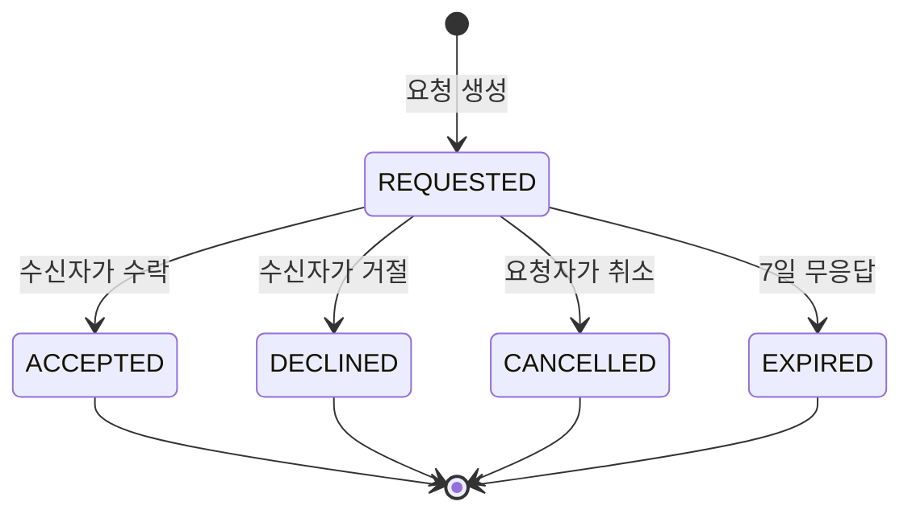

# 상태머신 - 컨택

> **기술 하이라이트 2번.** [[이미지 파이프라인]]과 함께 README에서 가장 공들여 설명할 지점.
> 엔티티 정의는 [[엔티티 - ContactRequest]]에 있다. 여기는 전이 규칙만 다룬다.

## 상태 전이

## 누가 어떤 전이를 일으킬 수 있는가

이게 이 상태머신의 핵심이다. 상태만 맞으면 되는 게 아니라 **주체까지 맞아야 한다.**

| 전이 | 가능한 주체 |
|---|---|
| → REQUESTED | 요청자 (PRO 또는 CUSTOMER) |
| REQUESTED → ACCEPTED | **수신자만** |
| REQUESTED → DECLINED | **수신자만** |
| REQUESTED → CANCELLED | **요청자만** |
| REQUESTED → EXPIRED | 시스템만 |

종료 상태(ACCEPTED, DECLINED, CANCELLED, EXPIRED)에서 나가는 전이는 없다. 마음이 바뀌면 새 요청을 만든다.

## 구현 원칙

**상태 전이는 도메인 레이어의 명시적 함수로만 수행한다.** `contactRequest.accept(actorId)` 같은 형태여야 하고, 어디서든 `UPDATE contact_requests SET status = ...`를 직접 날리는 건 금지다.

전이 함수는 **순수 함수로 분리**한다. 현재 상태와 행위자와 원하는 전이를 받아 새 상태 또는 도메인 에러를 반환한다. 이렇게 하면 DB 없이 테스트할 수 있고, 유효·무효 조합을 전부 검증하기 쉽다.

불가능한 전이 시도는 조용히 무시하지 않고 도메인 에러를 던진다.

## 연락처 공개는 상태에 종속된다

`ACCEPTED` 이전에는 상대의 연락처가 **어떤 API 응답에도** 포함되지 않아야 한다. 이걸 컨트롤러마다 if문으로 막으면 반드시 어딘가 빠진다. 응답 직렬화 레이어에서 한 번에 막는다. → [[권한 모델]]

검증 테스트를 반드시 쓴다. "REQUESTED 상태의 컨택 상세를 조회했을 때 응답 JSON에 phone 키가 존재하지 않는다."

## 상태 변경은 이벤트를 낳는다

각 전이는 도메인 이벤트를 발행하고 알림 핸들러가 그걸 소비한다. 상태머신이 알림 로직을 직접 알지 않게 한다. 나중에 이메일, 푸시, 카카오 알림톡이 붙어도 상태머신은 그대로다.

## 테스트 요구사항

유효·무효 전이 조합 전부. 최소 15케이스. [[P4 - 기능 구현]]의 P4-6 완료 조건에 명시되어 있다.

## 연결

[[엔티티 - ContactRequest]] · [[권한 모델]] · [[이미지 파이프라인]] · [[P4 - 기능 구현]] · [[열린 질문]] · [[MVP 범위]]
