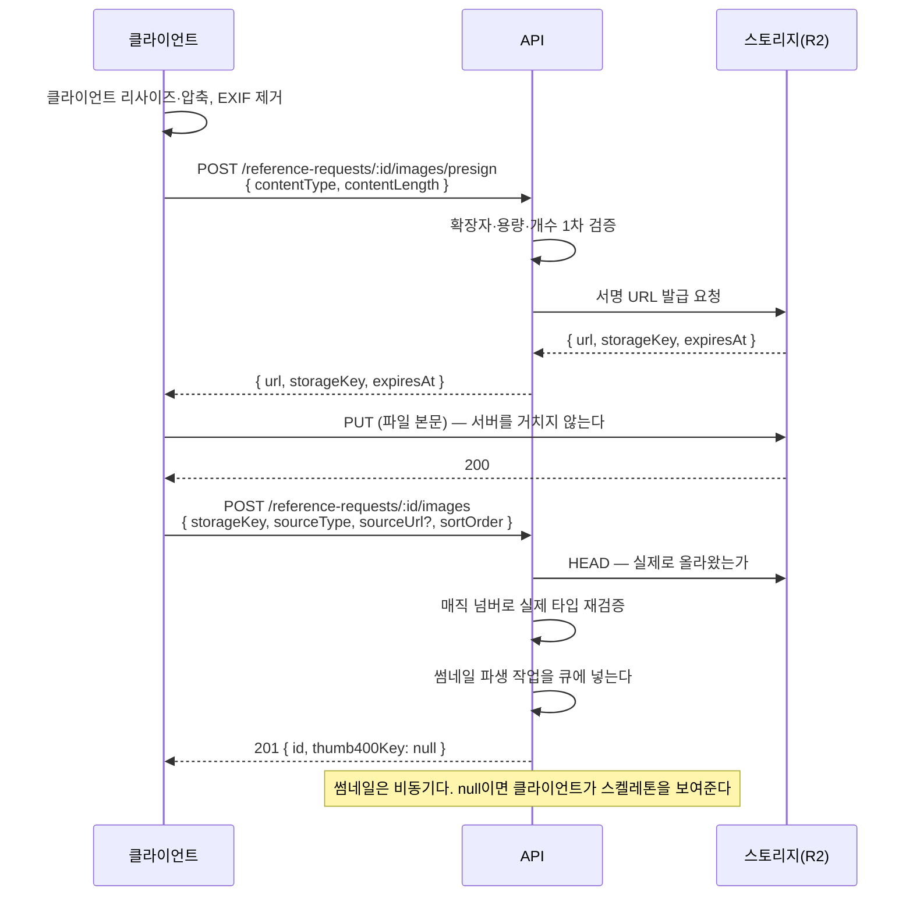

# API 명세

> **[[P3 - 데이터와 API 설계]] P3-2 산출물.** 스키마의 원본은 [[ERD]], 행위의 원본은 [[유저 스토리]], 권한의 원본은 [[권한 모델]]이다. 어긋나면 그쪽이 이긴다.

베이스 경로는 `/api`다. 모든 응답은 JSON이고 시각은 ISO 8601 UTC다.

---

## 공통 규약

### 에러 포맷

성공이 아닌 모든 응답은 같은 모양이다. 클라이언트가 상태 코드만 보고 분기하면 메시지를 바꿀 때마다 깨진다. **분기는 `code`로 한다.**

```json
{
  "code": "VALIDATION_FAILED",
  "message": "평수는 1~1000 사이여야 합니다.",
  "details": { "field": "areaPyeong", "given": 0 },
  "requestId": "e123663f-7f36-4fc3-b9ac-af183eda8d8e"
}
```

`code`는 도메인 에러 코드와 1:1이다. 매핑은 `apps/api/src/common/errors/domain-exception.filter.ts` 한 곳에 있다.

| 도메인 코드 | HTTP | 언제 |
|---|---|---|
| `VALIDATION_FAILED` | 400 | 입력이 규칙을 어김 |
| `UNAUTHENTICATED` | 401 | 토큰 없음·만료 |
| `FORBIDDEN` | 403 | 역할은 맞지만 주체가 아님 |
| `NOT_FOUND` | 404 | 없거나, 권한 때문에 숨김 |
| `CONFLICT` | 409 | 중복·이미 처리됨 |
| `INVALID_TRANSITION` | 409 | 불가능한 상태 전이 |
| `RATE_LIMITED` | 429 | 빈도 초과 |
| `INTERNAL_ERROR` | 500 | 그 외. 내부 정보를 흘리지 않는다 |

**404와 403을 구분하는 기준** — 존재를 알아도 되는 리소스면 403, 존재 자체가 비밀이면 404다. 남의 `DRAFT` 의뢰는 404다. 있다는 사실조차 알려줄 이유가 없다.

### 커서 페이지네이션

모든 목록이 커서 기반이다. 오프셋 파라미터는 **존재하지 않는다.** → [[구조적 원칙]] 5조

```
GET /api/portfolios?limit=20&cursor=eyJjIjoiMjAyNi0wNy0yNVQxMjowMDowMFoiLCJpIjoiOWY..."
```

```json
{
  "items": [ /* ... */ ],
  "nextCursor": "eyJjIjoi..." // 더 없으면 null
}
```

**커서 인코딩** — 정렬 키를 JSON으로 만들어 base64url로 감싼다.

```
payload = { "c": "<created_at ISO>", "i": "<id>" }
cursor  = base64url(JSON.stringify(payload))
```

정렬 키가 `created_at` 하나가 아니라 `(created_at, id)` 쌍인 이유는, 같은 시각에 만들어진 행이 둘이면 순서가 흔들려 **중복과 누락이 나기 때문**이다. 유니크한 `id`를 tie-breaker로 붙여야 커서가 안정된다.

조회 조건은 이렇게 된다.

```sql
WHERE (created_at, id) < ($cursorCreatedAt, $cursorId)
ORDER BY created_at DESC, id DESC
LIMIT $limit + 1   -- 하나 더 뽑아 다음 페이지 유무를 판단한다
```

커서는 클라이언트에게 **불투명한 문자열**이다. 내부 형식을 문서에 적어두긴 했지만 클라이언트가 파싱하거나 만들어내면 안 된다. 형식이 바뀌어도 서버만 고치면 되게 하려는 것이다. 해독 불가능한 커서는 `VALIDATION_FAILED`가 아니라 **첫 페이지로 취급**한다 — 사용자가 오래된 링크를 열었을 때 에러 화면보다 첫 페이지가 낫다.

`limit`은 기본 20, 최대 50. 넘기면 잘라낸다. 상한이 없으면 목록 하나로 DB를 태울 수 있다.

### 공통 필터

목록마다 지원하는 축이 다르다. 표의 ○만 받는다.

| 파라미터 | 형식 | 의뢰 | 갤러리 | 시공자 |
|---|---|:---:|:---:|:---:|
| `categories` | `WALLPAPER,TILE` (코드, 복수) | ○ | ○ | ○ |
| `regions` | `11290,11305` (시군구 코드, 복수) | ○ | ○ | ○ |
| `sort` | `latest` \| `popular` \| `responsive` | ○ | ○ | ○ |
| `areaMin` / `areaMax` | 숫자(평) | △ | △ | — |
| `housingType` | enum | △ | △ | — |

△는 **명세만 하고 MVP에서 구현하지 않는다.** [[백로그]] B-06에서 필터 축을 공종·지역 둘로 줄였기 때문이다. 다만 **데이터는 정확히 받고 있으므로**(`area_pyeong`, `housing_type`) 나중에 파라미터만 열면 된다. 안 받은 데이터는 소급되지 않지만 안 만든 필터는 나중에 만들면 된다.

공종·지역은 **복수 선택이 OR**다. "도배 또는 타일"이지 "도배이면서 타일"이 아니다. 후자는 초기 콘텐츠 양에서 거의 항상 0건이 된다.

### 인증

`Authorization: Bearer <accessToken>`. 액세스 토큰은 짧고, 갱신은 `POST /auth/refresh`로 한다. 상세는 ADR-002에서 정한다.

---

## `/auth`

| 메서드 | 경로 | 목적 | 인증 |
|---|---|---|---|
| POST | `/auth/signup` | 이메일 가입 | — |
| POST | `/auth/login` | 이메일 로그인 | — |
| POST | `/auth/kakao` | 카카오 로그인 ([[백로그]] B-01로 미룸) | — |
| POST | `/auth/refresh` | 토큰 갱신 | refresh 토큰 |
| POST | `/auth/logout` | 로그아웃 | ○ |

### POST /auth/signup

```json
// 요청
{ "email": "yoon@example.com", "password": "········", "nickname": "윤지수", "agreedToTerms": true }

// 201
{ "accessToken": "...", "refreshToken": "...", "user": { "id": "...", "email": "...", "nickname": "윤지수", "profileType": null } }
```

`profileType: null`이 역할 미선택 상태다. 클라이언트는 이 값이 null이면 역할 선택 화면으로 보낸다.

| 실패 | 코드 |
|---|---|
| 409 | `CONFLICT` — 이미 가입된 이메일 |
| 400 | `VALIDATION_FAILED` — 약관 미동의, 비밀번호 규칙 위반 |

**Rate limit 필요.** IP당 10회/시간. 가입 엔드포인트는 계정 대량 생성과 이메일 존재 여부 탐색에 쓰인다.

### POST /auth/login

실패 시 **이메일이 없는 것과 비밀번호가 틀린 것을 구분하지 않는다.** 둘 다 401 `UNAUTHENTICATED`에 같은 메시지다. 구분하면 계정 존재 여부가 새어나간다.

**Rate limit 필요.** 계정당 5회/10분, IP당 20회/10분. 크리덴셜 스터핑 방어다.

---

## `/me`

| 메서드 | 경로 | 목적 | 역할 |
|---|---|---|---|
| GET | `/me` | 내 정보 | 로그인 |
| PATCH | `/me` | 닉네임·연락처 수정 (**2026-07-26 구현**) | 로그인 |
| POST | `/me/profile` | **역할 선택** (US-002) | 로그인·역할 미정 |
| GET | `/me/pro-profile` | 내 시공자 프로필 | PRO |
| PUT | `/me/pro-profile` | 프로필 저장 | PRO |
| DELETE | `/me` | 탈퇴 | 로그인 |

### POST /me/profile

```json
// 요청
{ "type": "CUSTOMER" }

// 201
{ "profileType": "CUSTOMER", "next": "/requests/new" }
```

| 실패 | 코드 |
|---|---|
| 409 | `CONFLICT` — 이미 역할이 있다. **스스로 바꿀 수 없다** |

역할 변경은 API가 없다. [[화면 목록]]이 정한 대로 설정에서 전환을 *요청*하고 관리자가 처리한다.

### PATCH /me (2026-07-26 구현)

```json
// 요청 — 둘 다 선택이지만 빈 본문은 400 이다
{ "nickname": "윤지수", "phone": "01012345678" }
```

**P-01 프로필 편집이 이걸 부른다.** 연락처는 `User` 에 있어서 `PUT /me/pro-profile` 로는
저장할 수 없다. 같은 화면이 두 엔드포인트를 부르는 건 스키마가 그렇게 생겼기 때문이다 —
연락처는 역할과 무관한 계정의 속성이다.

**하이픈은 지우고 숫자만 저장한다.** 어느 쪽으로 넣어도 받는다 — 사람이 하이픈을
넣는 걸 오류로 취급할 이유가 없다. 형식은 `0` + 숫자 9~10자리.

**빈 본문을 거부한다.** 아무 일도 안 하는 200 은 버그를 숨긴다.

응답은 `GET /me` 와 같은 모양이다. 화면이 저장 후 다시 조회하지 않아도 되게 —
요청 하나 줄이는 것보다 **저장한 값과 화면이 보는 값이 갈라질 틈을 없애는 것**이 목적이다.

### GET /me/pro-profile

`ProProfile` 스칼라에 셋을 더 싣는다.

- `phone` — 본인 것이므로 `__revealedPhone` 으로 명시 공개한다. 이 값이 남에게 갈 경로는 없다
- `nickname` — 활동명이 비었을 때 아바타를 만들 이름
- `completeness` — `{ items, percent, requiredMet }`. **도메인이 계산한다**
  (`packages/domain/user/pro-profile.ts`). 화면이 세면 저장 결과와 어긋난다

`profile_completeness` 컬럼은 처음부터 있었지만 아무도 쓰지 않아 **항상 0이었다.**
`PUT /me/pro-profile` 이 저장 트랜잭션 안에서 갱신한다.

### PUT /me/pro-profile

`isDormant` 를 받는다(2026-07-26 추가). 컬럼은 있었는데 입력 스키마에 없어서
**휴면을 끌 방법이 없었다.** 휴면은 승인 취소와 다르다 — 본인이 잠시 내려두는 것이고
되돌릴 수 있어야 한다.

상한이 화면(P-01)과 다른 곳이 둘 있고 **둘 다 서버가 더 관대하다.**
`intro` 는 화면 300자 / 서버 2000자, `workCategoryCodes` 는 화면 3개 / 서버 13개.
반대 방향으로 만들면 화면이 통과시킨 입력이 저장에서 터진다.

### DELETE /me

진행 중(`REQUESTED`) 컨택이 있으면 409 `CONFLICT`다. 상대가 응답을 기다리는 중에 사라지면 안 된다.

---

## `/reference-requests` — 의뢰

**전부 로그인 필요하고 `noindex`다.** 의뢰 사진은 고객이 인터넷에서 가져온 남의 저작물일 확률이 높아 공개 색인 대상이 아니다. → [[리스크 - 레퍼런스 사진 저작권]]

| 메서드 | 경로 | 목적 | 역할 |
|---|---|---|---|
| GET | `/reference-requests` | 의뢰 목록 (시공자용) | PRO(승인됨) |
| GET | `/reference-requests/:id` | 의뢰 상세 | PRO(승인됨) 또는 소유자 |
| POST | `/reference-requests` | 임시저장 생성 | CUSTOMER |
| PATCH | `/reference-requests/:id` | 수정·단계 저장 | 소유자 |
| POST | `/reference-requests/:id/publish` | 공개 | 소유자 |
| POST | `/reference-requests/:id/close` | 마감 | 소유자 |
| DELETE | `/reference-requests/:id` | 삭제(soft) | 소유자 |
| GET | `/reference-requests/:id/proposals` | **받은 제안 목록** (C-03) | 소유자 |
| GET | `/me/reference-requests` | 내 의뢰 목록 | CUSTOMER |

### POST /reference-requests

```json
// 요청 — 확장 규약이 여기서 가장 강하게 걸린다
{
  "title": "성북구 24평 도배+장판",
  "areaPyeong": 24,
  "housingType": "APARTMENT",
  "regionCode": "11290",
  "workCategoryCodes": ["WALLPAPER", "FLOORING"],
  "isOccupied": true,
  "materialGrade": "STANDARD",
  "desiredStartAt": "2026-08-10",
  "desiredEndAt": "2026-08-20",
  "budgetMin": 3000000,
  "budgetMax": 5000000,
  "description": "거주 중이라 주말 시공을 원합니다"
}
```

**타입이 곧 규약이다.** `areaPyeong`은 `number`이지 `string`이 아니고, `regionCode`는 시군구 코드이지 주소 문자열이 아니며, `workCategoryCodes`는 `WorkCategory.code` 배열이지 한글 라벨이 아니다. 서버가 이걸 다시 검증한다 — 클라이언트 검증은 우회할 수 있다.

```json
// 201
{ "id": "...", "status": "DRAFT", "areaPyeong": 24, "areaM2": 79.34, ... }
```

`areaM2`는 **DB 생성 컬럼**이라 요청에 넣을 수 없다. 넣으면 무시가 아니라 400이다. 무시하면 클라이언트가 자기가 보낸 값이 반영됐다고 착각한다.

| 실패 | 코드 |
|---|---|
| 400 | `VALIDATION_FAILED` — 평수 범위 밖, 존재하지 않는 공종 코드/지역 코드 |
| 403 | `FORBIDDEN` — CUSTOMER가 아님 |

### POST /reference-requests/:id/publish

사진 1장 이상 + 모든 사진의 출처 지정 + 필수 조건 입력이 끝나야 통과한다.

| 실패 | 코드 | 조건 |
|---|---|---|
| 400 | `VALIDATION_FAILED` | 사진 0장, 출처 미지정 사진 존재, 필수 항목 누락 |
| 409 | `CONFLICT` | 이미 PUBLISHED |

### GET /reference-requests/:id/proposals (2026-07-26 구현)

C-03 이 부른다. **`GET /contacts` 로는 안 되는 이유가 있다** — 그 목록은 "내 컨택 전부"를
상대 요약과 함께 주는데, C-03 은 **한 의뢰 안에서 제안을 서로 비교하는 화면**이라
시공자의 승인 여부·경력·활동 지역·사례 사진까지 한 응답에 있어야 한다.
목록을 보고 프로필로 나갔다 돌아오게 만들면 비교가 끊긴다.

```json
// 200 — 커서 페이지네이션. 정렬은 (createdAt, id) 내림차순
{
  "items": [
    {
      "id": "...", "status": "REQUESTED",
      "message": "…", "proposedAmount": 780000, "proposedAmountNote": "자재 포함 · 1일",
      "expiresAt": "…", "respondedAt": null, "createdAt": "…",
      "pro": {
        "id": "...",                       // userId. `/pros/:id` 와 같은 이름이다
        "businessName": "성북 한도배", "careerYears": 12, "isApproved": true,
        "categories": [ … ], "serviceAreas": ["성북구", "강북구"],
        "hasPublicProfile": true           // 승인 + 활동명 있음. false 면 링크를 걸면 404 다
      },
      "recentCovers": [{ "id": "…", "coverThumbKey": "…" }]
    }
  ],
  "nextCursor": null
}
```

| 실패 | 코드 | 왜 |
|---|---|---|
| 404 | `NOT_FOUND` | 남의 의뢰. **403 은 "그 의뢰가 존재한다"를 알려준다** |
| 403 | `FORBIDDEN` | 시공자. 경쟁 제안을 보게 된다 |
| 401 | `UNAUTHENTICATED` | 비로그인 |

**`phone` 을 SELECT 하지 않는다.** 수락해도 이 목록은 변하지 않는다 —
연락처 공개는 컨택 상세(M-02)가 전이를 확인한 뒤에 하는 일이다.

사례 사진은 `IN` 한 번으로 묶어 가져온다. 제안마다 조회하면 20건에 21쿼리다.

### 다시 열기는 별도 API 가 아니다

C-03 의 `다시 열기` 는 `POST /reference-requests/:id/publish` 를 다시 부른다.
`publish` 는 **이미 PUBLISHED 일 때만** 거부하므로 CLOSED 를 되살릴 수 있고,
그 과정에서 필수 항목을 재검증한다.

재검증이 실패할 수 있다 — 사진을 지운 뒤라면 400 이다. 그때 `details.missing` 이
빠진 필드 이름을 준다. **화면은 그걸 사람 말로 바꿔야 한다**: 서버 메시지
("필수 항목이 비어 있습니다")만으로는 무엇을 고칠지 알 수 없다.

### 이미지 — 서명 URL 흐름

**파일이 서버를 경유하지 않는다.** 서버 대역폭과 메모리를 아끼고 대용량에서도 안정적이다.



**메타데이터 등록(마지막 POST)이 오지 않으면 스토리지에 파일만 남는다.** 이게 고아 파일이고, 미등록 키에 TTL을 두고 정리하는 배치가 따로 돈다.

```json
// POST /reference-requests/:id/images 요청
{ "storageKey": "reference/2026/07/9f3a....jpg", "sourceType": "EXTERNAL", "sourceUrl": "https://ohou.se/contents/12345", "sortOrder": 0 }
```

| 실패 | 코드 | 조건 |
|---|---|---|
| 400 | `VALIDATION_FAILED` | `EXTERNAL`인데 `sourceUrl` 없음·URL 형식 아님 / `SELF`인데 `sourceUrl` 있음 |
| 400 | `VALIDATION_FAILED` | 매직 넘버가 허용 타입이 아님 (확장자 위조) |
| 409 | `CONFLICT` | 10장 초과 |

출처 규칙은 **DB CHECK 제약으로도 막혀 있다.** API 검증을 빠뜨려도 INSERT가 거부된다. → [[ERD]]

**Rate limit 필요.** presign은 계정당 100회/시간. 서명 URL을 무한 발급받아 스토리지를 채우는 걸 막는다.

---

## `/portfolios` — 포트폴리오

| 메서드 | 경로 | 목적 | 역할 |
|---|---|---|---|
| GET | `/portfolios` | 갤러리 목록 | **비로그인 공개** |
| GET | `/portfolios/:id` | 상세 | **비로그인 공개** |
| POST | `/portfolios` | 생성 | PRO |
| PATCH | `/portfolios/:id` | 수정 | 소유자 |
| DELETE | `/portfolios/:id` | 삭제 | 소유자 |
| POST | `/portfolios/:id/images/presign` | 서명 URL | 소유자 |
| POST | `/portfolios/:id/images` | 메타 등록 | 소유자 |

### GET /portfolios

**공개 조건이 두 개다.** 포트폴리오가 `PUBLISHED`이고 **소속 시공자가 승인됨**이어야 한다. 하나만 보고 공개하는 실수를 하기 쉬워서 [[ERD]]에서 인덱스를 그렇게 잡았다.

```sql
WHERE p.status = 'PUBLISHED'
  AND p.deleted_at IS NULL
  AND pro.is_approved = true
  AND pro.is_dormant = false
```

```json
// 200 — 목록 응답. 400px 썸네일만 실린다
{
  "items": [{
    "id": "...",
    "title": "화이트 실크 + 우드 몰딩",
    "coverThumbUrl": "https://cdn.../thumb400/9f3a.webp",
    "photoCount": 8,
    "areaPyeong": 24,
    "region": { "code": "11290", "name": "성북구" },
    "categories": [{ "code": "WALLPAPER", "nameKo": "도배" }],
    "pro": {
      "id": "...", "businessName": "김도배",
      "isApproved": true, "careerYears": 11, "jobCount": 87, "isCostPublic": true
    }
  }],
  "nextCursor": "eyJjIjoi..."
}
```

**원본 URL은 목록 응답에 없다.** 목록 성능의 대부분이 이 규칙 하나다. → [[구조적 원칙]] 6조

`pro`에 승인 뱃지·경력·시공 건수를 담는 이유는 [[시안 검수 결과]] 10번이다. 갤러리 카드에 신뢰 신호가 하나도 없어서 사람을 평가하려면 상세로 들어가야 했다. **비로그인 SEO 관문에서 판단 근거가 0인 건 치명적**이라 목록 응답에 넣었다.

---

## `/pros` — 시공자

**2026-07-26 구현됨.** C-06·C-07 화면을 만들면서 함께 만들었다.
아래는 **실제 응답**이고, 명세와 달라진 곳은 이유를 붙였다.

| 메서드 | 경로 | 목적 | 역할 |
|---|---|---|---|
| GET | `/pros` | 목록 | **비로그인 공개** |
| GET | `/pros/:id` | 프로필 상세 | **비로그인 공개(연락처 제외)** |

**목록을 [[백로그]] B-04 에서 끌어왔다.** C-06 을 만들려면 목록이 있어야 하고,
프로필 상세만 열려 있으면 그 프로필로 가는 길이 없다.

**역할을 `CUSTOMER` → 비로그인 공개로 바꿨다.** 같은 표의 상세가 이미 공개이고,
포트폴리오가 공개인데 그걸 만든 사람을 찾는 목록만 잠글 이유가 없다.
→ [[화면 목록]] "C-06 을 비로그인 공개로 바꿨다"

### 스키마는 건드리지 않았다

`ProProfile` 과 `PortfolioItem` 을 시공자 기준으로 다시 묶는 **읽기 전용 조회**다.
새 테이블도 새 컬럼도 없다. 그래서 명세가 적어둔 필드 중 **DB 에 없는 것은 뺐다.**

| 명세 | 실제 | 왜 |
|---|---|---|
| `jobCount: 87` | `portfolioCount` | **시공 건수를 세는 곳이 없다.** 우리가 아는 건 올라온 사례 수뿐이다 |
| `isCostPublic` | `hasCostPublic` | `ProProfile` 에 없는 필드다. 그 시공자의 사례 중 하나라도 공개면 `true` |
| `isApproved` | 뺐다 | **응답에 오는 시공자는 전부 승인됐다.** 항상 `true` 인 필드는 정보가 아니다 |
| — | `joinedAt` 추가 | 경력과 다른 신호다. "언제부터 이 서비스에 있었는가" |
| — | `recentCovers` 추가 | 목록 카드에 최근 사례 넉 장을 깐다(400px 파생만) |

없는 숫자를 지어내지 않는 이유는 이 화면의 목적이 "맡겨도 되는 사람인지 판단"이라
근거가 거짓이면 화면 자체가 무의미해지기 때문이다. → [[시안 대조 결과]] C-06·C-07 절

### 공개 조건은 포트폴리오와 같은 문장이다

```
isApproved: true  AND  isDormant: false  AND  businessName != ''
```

앞의 둘은 `GET /portfolios` 와 **정확히 같다.** 갈라지면 갤러리에는 보이는데
프로필은 404 인 상태가 생긴다. 세 번째는 2026-07-26 에 추가했다 —
역할을 고르면 프로필 행이 자동 생성되므로 상호가 빈 계정이 존재하고,
그건 승인 여부와 무관하게 **아직 등록을 마치지 않은 사람**이다.

### 식별자는 `userId` 다

`ProProfile` 의 PK 는 `userProfileId` 지만 **응답의 `id` 는 `userId`** 다.
`GET /portfolios` 의 `pro.id` 가 이미 `userId` 이므로 같은 사람을 부르는 이름이
둘이 되면 안 된다. 처음에 `userProfileId` 로 냈다가 C-05 의 `프로필 전체 보기`
링크가 404 가 났고, e2e 로 고정했다(`test/pros.e2e-spec.ts`).

### GET /pros

```json
// 200 — 커서 페이지네이션. 정렬은 (createdAt, userProfileId) 내림차순
{
  "hasAnyContent": true,
  "items": [
    {
      "id": "...",                                  // userId
      "businessName": "성북 한도배", "intro": "...",
      "careerYears": 12,
      "categories": [{ "code": "WALLPAPER", "nameKo": "도배" }],
      "serviceAreas": [{ "code": "11290", "sigunguName": "성북구" }],
      "portfolioCount": 2,
      "recentCovers": ["portfolio/…/after_400.webp"],
      "hasCostPublic": true
    }
  ],
  "nextCursor": null
}
```

질의: `categories` · `regions`(CSV) · `costPublic=true` · `cursor` · `limit`(≤50).
`costPublic` 은 사례의 속성이라 조회 후 걸러낸다 — 프로필 쿼리로 표현하면 조인이 한 겹
더 붙고 초기 규모에서 그 비용이 이득보다 크다. 목록이 커지면 집계 컬럼으로 옮긴다.

### GET /pros/:id

```json
// 200 — 비로그인이든 로그인이든 동일하다
{
  "id": "...", "businessName": "성북 한도배", "intro": "...",
  "careerYears": 12, "joinedAt": "2026-07-25T…",
  "categories": [{ "code": "WALLPAPER", "nameKo": "도배" }],
  "serviceAreas": [{ "code": "11290", "sigunguName": "성북구" }],
  "portfolioCount": 2, "hasCostPublic": true,
  "portfolios": [
    { "id": "...", "title": "…", "areaPyeong": "24", "isCostPublic": true,
      "workedAt": "2026-05-01", "coverThumbKey": "…", "photoCount": 2,
      "categories": [ … ], "region": { … } }
  ]
}
```

**없는 시공자·미승인·휴면·무명이 전부 같은 404 다.** 구분해 알려주면
"그 사람은 존재한다"가 새고, 승인 취소는 관리자의 판단이지 공개할 정보가 아니다.

**`phone` 키가 없다.** 마스킹된 문자열이 들어 있는 게 아니라 키 자체가 없다 —
이 조회는 `phone` 을 아예 SELECT 하지 않는다. → 아래 「연락처가 실릴 수 있는 모든 응답」

---

## `/contacts` — 컨택

| 메서드 | 경로 | 목적 | 역할 |
|---|---|---|---|
| GET | `/contacts` | 목록 (`box=received\|sent`) | 로그인 |
| GET | `/contacts/:id` | 상세 | **당사자만** |
| POST | `/contacts` | 요청 생성 | 로그인 |
| POST | `/contacts/:id/accept` | 수락 | **수신자만** |
| POST | `/contacts/:id/decline` | 거절 | **수신자만** |
| POST | `/contacts/:id/cancel` | 취소 | **요청자만** |
| POST | `/contacts/:id/view-contact` | 연락처 열람 기록 | 당사자·ACCEPTED |

### POST /contacts

```json
// 요청 — direction에 따라 대상이 달라진다
{ "direction": "PRO_TO_REQUEST", "referenceRequestId": "...", "message": "거실 실크, 아이방 합지로 진행 가능합니다." }
```

| 실패 | 코드 | 조건 |
|---|---|---|
| 409 | `CONFLICT` | 같은 상대에게 진행 중 요청 존재 (DB 부분 유니크 인덱스가 최종 방어선) |
| 429 | `RATE_LIMITED` | 하루 요청 한도 초과 |
| 403 | `FORBIDDEN` | 미승인 PRO |
| 400 | `VALIDATION_FAILED` | direction과 대상 FK 불일치, 자기 자신 |
| 409 | `CONFLICT` | 마감된 의뢰 |

**Rate limit 필요.** 계정당 20건/일. 시공자가 모든 의뢰에 무차별 제안을 보내면 고객 경험이 무너진다. → [[리스크 레지스터]]

### POST /contacts/:id/accept

```json
// 200 — 수락 즉시 같은 응답에 연락처가 열린다. 별도 조회가 필요 없다
{
  "id": "...", "status": "ACCEPTED", "respondedAt": "2026-07-25T14:40:00Z",
  "counterpart": { "id": "...", "nickname": "윤지수", "phone": "010-4821-9930" }
}
```

| 실패 | 코드 | 조건 |
|---|---|---|
| 409 | `INVALID_TRANSITION` | **요청자가 수락 시도** — 상태만 맞아서는 안 되고 주체가 맞아야 한다 |
| 409 | `INVALID_TRANSITION` | 이미 종료 상태(경쟁 상태) |
| 404 | `NOT_FOUND` | 당사자가 아님 — 403이 아니다. 남의 컨택은 존재 자체가 비밀이다 |

---

## `/scraps`, `/reports`, `/admin`

| 메서드 | 경로 | 역할 | 비고 |
|---|---|---|---|
| GET/POST/DELETE | `/scraps` | 로그인 | [[백로그]] B-07로 미룸 |
| POST | `/reports` | 로그인 · 저작권은 **비로그인 허용** | 권리자가 계정이 없을 수 있다 |
| GET | `/admin/pro-approvals` | ADMIN | 승인 큐 (A-01) |
| POST | `/admin/pro-approvals/:userProfileId` | ADMIN | 승인·반려·**되돌리기** |
| GET | `/admin/reports` | ADMIN | 신고 큐 (A-02) |
| POST | `/admin/reports/:id/resolve` | ADMIN | 인정(비공개) 또는 기각 |

`POST /reports`에 **Rate limit 필요** — 계정·IP당 10건/시간. 신고 폭탄으로 콘텐츠를 내리는 걸 막는다.

### 관리자 큐가 판단 근거를 함께 준다 (2026-07-26)

A-01 을 만들면서 `GET /admin/pro-approvals` 를 넓혔다. **한 줄에 판단 근거를 다 넣는
것이 그 화면의 설계**이기 때문이다 — 대부분은 목록에서 바로 처리하고 애매한 것만
상세를 연다.

```json
{
  "items": [{
    "userProfileId": "…", "userId": "…",     // userId 는 화면 링크용
    "businessName": "", "businessNumber": null, "careerYears": 0,
    "profileCompleteness": 0, "rejectionReason": null,
    "categories": [], "serviceAreas": [], "portfolioCount": 0,
    "flags": ["활동명 미입력", "사업자번호 미제출", "공종 미선택", "활동 지역 미선택", "포트폴리오 0건", "소개 미작성"],
    "risk": "high",                           // 신호 3개 이상이면 high
    "submittedAt": "…"
  }],
  "pendingCount": 7, "approvedToday": 3
}
```

**`flags` 는 전부 우리가 아는 사실에서 계산된다.** 시안이 그린 위험 신호가
지어낸 값이 아니었다 — 서류 저장이 없어 자격증만 못 보고 나머지는 다 센다.
심각도 컬럼이 없으므로 **세는 것이 유일하게 정직한 방법**이다.

**되돌리기는 별도 경로가 아니다.** 같은 엔드포인트에 `approved: false` 를 보낸다.
승인을 되돌리면 그 시공자의 사례가 즉시 공개에서 빠진다 —
공개 조건 두 번째가 `isApproved` 이기 때문이다.

`GET /admin/reports` 도 넓혔다. `Report` 에는 심각도도 증거 사진도 없어서
**같은 대상의 누적 신고 수**를 세고(재발이 심각도의 실질적 대체다), 대상의
이름과 상태를 해석해 붙인다 — UUID 만 보여주면 심사자가 무엇을 판단하는지 모른다.

부수 효과가 하나 좋다. 같은 대상의 두 번째 신고에 `target.status: "HIDDEN"` 이 와서
**첫 조치로 이미 처리됐다는 걸 알 수 있다.**

**`USER` 대상 신고를 인정해도 계정은 정지되지 않는다.** 신고 하나로 내릴 판단이
아니고 정지를 되돌리는 경로도 없다. 신고는 `ACCEPTED` 로 남아 기록이 되고
조치는 사람이 따로 한다. 화면이 그렇게 적어둔다.

### ADMIN 은 어떻게 만드나

`POST /me/profile` 은 CUSTOMER/PRO 만 받는다(그게 맞다). 시드로만 만든다고
적혀 있었지만 **어느 시드도 만들지 않아서 ADMIN 을 만들 방법이 아예 없었다.**

```bash
pnpm --filter @fitter/api db:seed:admin admin@fitter.local '비밀번호'
```

비밀번호는 **실행 인자로만** 받는다. 저장소에 적힌 비밀번호는 뒷문이다 —
데모 시드가 시공자 계정의 `passwordHash` 를 일부러 null 로 두는 것과 같은 이유다.

---

## 권한 규칙 — 두 층을 분리한다

성격이 달라서 같은 곳에서 처리하지 않는다. → [[권한 모델]]

**역할 검사는 Guard(미들웨어)에서.** 요청만 보고 판단할 수 있다.
`@Roles('PRO')`, `@ApprovedPro()`, `@Roles('ADMIN')`.

**소유자 검사는 서비스 레이어에서.** 리소스를 읽어봐야 알 수 있으므로 미들웨어에 올 수 없다. 그리고 엔드포인트마다 따로 짜면 반드시 어딘가 빠지므로 **재사용 유틸 하나**로 만든다.

```ts
assertOwner(resource.ownerId, actor.id);        // 소유자만
assertParticipant(contact, actor.id);           // 컨택 당사자만
```

| 엔드포인트 | 역할(Guard) | 소유자(Service) |
|---|---|---|
| `PATCH /reference-requests/:id` | CUSTOMER | `assertOwner` |
| `POST /portfolios/:id/images` | PRO | `assertOwner` |
| `GET /contacts/:id` | 로그인 | `assertParticipant` |
| `POST /contacts/:id/accept` | 로그인 | `assertParticipant` + **수신자 여부는 도메인 전이 함수가 검증** |
| `GET /reference-requests` | PRO + 승인됨 | — |

수락의 주체 검증을 서비스가 아니라 **도메인 전이 함수**에 둔 게 중요하다. 서비스에 두면 다른 호출 경로가 생겼을 때 빠진다. → [[상태머신 - 컨택]]

---

## 작성 후 점검 1 — N+1이 나기 쉬운 곳 셋

**첫째, 갤러리 목록의 공종.** 포트폴리오 20건마다 `categories`를 따로 조회하면 21번 쿼리가 된다. 대응은 `IN` 절 한 번으로 모아 가져와 메모리에서 매핑하는 것이다(Prisma `include`가 이걸 해준다). **단, `include`를 중첩하면 이번엔 카티션 곱이 커진다** — 사진까지 함께 include하지 않고, 목록에는 대표 사진 한 장만 별도 쿼리로 모아 온다.

**둘째, 목록의 시공자 정보.** 카드마다 승인 여부·경력·시공 건수를 보여주므로 `pro`를 매번 조회하면 같은 문제가 난다. 조인 한 번으로 가져오되, **`jobCount`는 매번 집계하면 안 된다.** `COUNT(*)`가 20번 도는 것과 같다. 집계 캐시 컬럼이 필요하다(→ [[ERD]] 자문자답 3번).

**셋째, 컨택 목록의 상대 정보.** 20건이면 상대 20명을 조회한다. 여기가 특히 위험한 이유는 **상대 조회가 곧 `phone`이 실린 엔티티를 메모리에 올리는 일**이기 때문이다. 직렬화에서 막더라도 로그에 찍히면 새어나간다. 그래서 목록 쿼리는 애초에 `phone`을 `SELECT`하지 않는다.

---

## 작성 후 점검 2 — 권한을 빠뜨리기 쉬운 엔드포인트 셋

**첫째, `POST /reference-requests/:id/images`.** 사진 등록은 의뢰 생성과 다른 엔드포인트라 소유자 검사를 잊기 쉽다. **남의 의뢰에 내 사진을 붙일 수 있으면** 저작권 신고 대상이 남의 계정으로 간다.

**둘째, `GET /reference-requests/:id`.** 목록에는 `PUBLISHED`만 나오지만 상세는 ID를 알면 접근된다. `DRAFT`인 남의 의뢰가 열리면 미완성 콘텐츠가 새고, 그건 목록 쿼리 필터를 상세에 복사하지 않아서 생긴다.

**셋째, `POST /contacts/:id/view-contact`.** 부수적인 기록용 엔드포인트라 검사가 얇아지기 쉽다. 그런데 이건 **연락처를 반환하는 경로**다. 당사자 확인과 `ACCEPTED` 확인이 둘 다 필요하다.

셋 다 공통점이 있다. **주 엔드포인트가 아니라 곁가지**라는 것이다. 그래서 소유자 검사를 유틸 하나로 만들고, 새 엔드포인트를 추가할 때 그 유틸을 부르지 않으면 리뷰에서 걸리게 한다.

---

## 작성 후 점검 3 — `phone`이 실릴 수 있는 모든 응답

**이 프로젝트에서 가장 조용하고 가장 위험한 버그가 날 수 있는 지점이다.** 화면에서 안 보이는 것과 응답에 없는 것은 완전히 다르다.

| # | 응답 | 어떻게 차단하는가 |
|---|---|---|
| 1 | `GET /contacts/:id` | 직렬화 레이어가 `status === 'ACCEPTED' && 당사자`일 때만 `counterpart.phone`을 채운다 |
| 2 | `GET /contacts` (목록) | **상태와 무관하게 항상 제외.** 목록에서 연락처를 보여줄 이유가 없다. 쿼리에서 `phone`을 SELECT하지 않는다 |
| 3 | `POST /contacts/:id/accept` | 전이 성공 직후이므로 `ACCEPTED`가 보장된다. 유일하게 정상적으로 실리는 경로 |
| 4 | `GET /reference-requests/:id` 의 `customer` | 의뢰 상세에 딸린 요청자 정보. **절대 포함하지 않는다** |
| 5 | `GET /pros/:id` | 시공자 프로필. 비로그인·로그인 모두 제외 |
| 6 | `GET /me` | 본인 것이므로 포함한다. 남의 것과 구분되는 유일한 경우 |
| 7 | `GET /admin/*` | 관리자도 예외가 아니다. 운영상 필요하면 별도 감사 로그가 남는 엔드포인트를 따로 만든다 |
| 8 | 에러 응답의 `details` | 검증 에러에 입력값을 담다가 전화번호가 섞일 수 있다. `details`에 사용자 입력을 그대로 넣지 않는다 |
| 9 | **로그** | 응답에서 막아놓고 로그로 새면 막은 게 아니다. pino `redact`에 `*.phone`을 걸어뒀다 |

**구현 방식** — 컨트롤러마다 조건문을 넣지 않는다. 반드시 어딘가 빠진다. **응답 직렬화 인터셉터 한 곳**에서 기본값을 "포함하지 않음"으로 두고, 명시적으로 공개 조건을 만족할 때만 채운다. 새 엔드포인트를 추가해도 별도 조치 없이 안전한 쪽이 기본이어야 한다. → [[권한 모델]]

**테스트 요구** — 위 1·2·4·5 각각에 대해 응답 JSON에 `phone` **키가 없음**을 검증하는 테스트를 쓴다(값이 마스킹됐는지가 아니다). [[유저 스토리]] US-042.

---

## Rate limit 요약

| 엔드포인트 | 한도 | 이유 |
|---|---|---|
| `POST /auth/login` | 계정 5회/10분, IP 20회/10분 | 크리덴셜 스터핑 |
| `POST /auth/signup` | IP 10회/시간 | 대량 계정 생성, 이메일 존재 탐색 |
| `POST /contacts` | 계정 20건/일 | 무차별 제안이 고객 경험을 무너뜨린다 |
| `POST /*/images/presign` | 계정 100회/시간 | 서명 URL 남발로 스토리지 채우기 |
| `POST /reports` | 계정·IP 10건/시간 | 신고 폭탄으로 콘텐츠 내리기 |

---

## 연결

[[ERD]] · [[유저 스토리]] · [[PRD]] · [[권한 모델]] · [[상태머신 - 컨택]] · [[구조적 원칙]] · [[확장 규약]] · [[백로그]] · [[시안 검수 결과]] · [[리스크 - 레퍼런스 사진 저작권]] · [[리스크 레지스터]] · [[P3 - 데이터와 API 설계]] · [[진행 현황판]]
