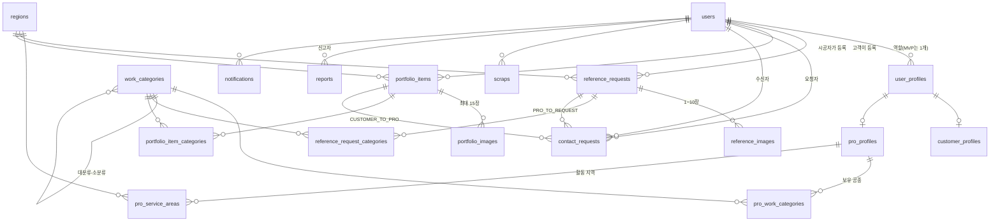

# ERD

> **[[P3 - 데이터와 API 설계]] P3-1 산출물.** 스키마는 `apps/api/prisma/schema.prisma`, 마이그레이션 SQL은 `apps/api/prisma/migrations/`.
> 이 문서는 **파생물이다.** 정의의 원본은 `20-도메인`의 엔티티 노트들이고, 어긋나면 그쪽이 이긴다.

이 스키마의 목표는 하나다. **[[확장 규약]]을 사람의 선의가 아니라 DB 제약으로 지키는 것.** 시안 검수에서 평수·지역이 자유 텍스트로 새고 공종이 다섯 갈래로 갈라진 걸 봤기 때문에, 애플리케이션이 실수해도 DB가 막게 만든다.

---

## 전체 ERD



---

## 열린 질문 Q2에 대한 답 — 역할을 별도 테이블로 뺀다

[[엔티티 - User와 역할]]이 ERD 설계 때 판단하라고 넘긴 항목이다. **`users.role` 컬럼이 아니라 `user_profiles` 테이블로 간다.**

근거는 [[화면 목록]]이 이미 정리해둔 그대로다. 계정당 역할 1개라는 판단 자체는 유지하되(권한 모델이 단순해지고 PRO 승인 단위가 계정이 된다), **스키마까지 1개로 못 박으면 2차에 마이그레이션이 필요해진다.** 시공자가 자기 집을 의뢰하고 싶은 경우는 실제로 있다.

그래서 `users 1—N user_profiles`로 두고 **MVP에서는 애플리케이션이 1개만 만들도록 막는다.** DB 제약으로 1개를 강제하지 않는 이유는, 그 제약을 푸는 순간이 곧 기능을 여는 순간이어야 하기 때문이다. 지금 `UNIQUE(user_id)`를 걸면 2차에 그걸 지우는 마이그레이션이 또 필요하다.

역할 선택 전 상태는 `user_profiles` 행이 **없는** 상태로 표현된다. nullable 컬럼보다 정직하다.

---

## 테이블 명세

### users — 계정

| 컬럼 | 타입 | NULL | 기본값 | 설명 |
|---|---|---|---|---|
| `id` | uuid | N | `gen_random_uuid()` | PK |
| `email` | citext | N | | UNIQUE. 대소문자 구분 안 함 |
| `password_hash` | text | Y | | 소셜 전용 계정은 null |
| `provider` | enum | N | `LOCAL` | LOCAL / KAKAO |
| `nickname` | text | N | | |
| `phone` | text | Y | | **컨택 ACCEPTED 전에는 어떤 응답에도 실리지 않는다** |
| `is_active` | boolean | N | `true` | |
| `created_at` / `updated_at` | timestamptz | N | `now()` | |
| `deleted_at` | timestamptz | Y | | soft delete |

`phone`은 DB에는 평문으로 있고 노출 통제는 응답 직렬화에서 한다. DB에서 막을 수 없는 이유는 "누가 조회했는가"를 DB가 모르기 때문이다. → [[권한 모델]]

### user_profiles — 역할

| 컬럼 | 타입 | NULL | 설명 |
|---|---|---|---|
| `id` | uuid | N | PK |
| `user_id` | uuid | N | FK users, ON DELETE CASCADE |
| `type` | enum | N | CUSTOMER / PRO / ADMIN |
| `created_at` / `updated_at` / `deleted_at` | timestamptz | | |

`UNIQUE(user_id, type)` — 같은 역할을 두 번 갖지 않는다. ADMIN은 시드로만 만든다.

### customer_profiles / pro_profiles

둘 다 `user_profile_id`가 PK이자 FK다(1:0..1). 프로필이 있어야만 상세 정보가 존재한다.

**pro_profiles** 주요 컬럼: `business_name`, `intro`, `career_years`(int), `business_number`(선택), `is_approved`(bool, 기본 false), `approved_at`, `rejection_reason`, `profile_completeness`(int 0~100), `is_dormant`.

`is_approved`가 이 테이블의 핵심이다. [[엔티티 - PortfolioItem]]의 공개 조건이 **포트폴리오 PUBLISHED + 시공자 승인** 둘 다이므로, 목록 쿼리는 반드시 이 테이블을 조인한다.

### work_categories — 공종 코드 테이블

| 컬럼 | 타입 | NULL | 설명 |
|---|---|---|---|
| `id` | int | N | PK |
| `code` | text | N | UNIQUE. `WALLPAPER` 등 |
| `name_ko` | text | N | 화면 표시용 |
| `parent_id` | int | Y | 자기참조. 대분류-소분류 |
| `sort_order` | int | N | |
| `is_active` | boolean | N | |

시드 13종은 `packages/shared/src/work-categories.ts`와 **같은 목록**이다. 코드가 정본이고 시드가 그것을 따른다. [[확장 규약]] 2조.

계층을 지금 쓰지 않지만 컬럼은 둔다. "도배" 아래 "실크/합지"가 생길 때 테이블을 안 바꿔도 되게.

### regions — 행정구역

| 컬럼 | 타입 | 설명 |
|---|---|---|
| `code` | char(5) | PK. 시군구 코드 |
| `sido_code` | char(2) | 시도 코드 |
| `sido_name` / `sigungu_name` | text | 표시용 |
| `is_active` | boolean | |

**주소 원문 컬럼은 어디에도 없다.** [[확장 규약]] 3조이자 개인정보 최소 수집이다. 상세 주소는 컨택 수락 후 당사자끼리 직접 주고받는다.

### reference_requests — 레퍼런스 의뢰

| 컬럼 | 타입 | NULL | 설명 |
|---|---|---|---|
| `id` | uuid | N | PK |
| `customer_user_id` | uuid | N | FK users, RESTRICT |
| `title` / `description` | text | | |
| `status` | enum | N | DRAFT / PUBLISHED / CLOSED / HIDDEN |
| `area_pyeong` | decimal(6,2) | N | **[[확장 규약]] 1조** |
| `area_m2` | decimal(8,2) | N | **GENERATED ALWAYS** — 파생이지 입력이 아니다 |
| `housing_type` | enum | N | APARTMENT / VILLA / OFFICETEL / HOUSE / COMMERCIAL |
| `region_code` | char(5) | N | FK regions |
| `desired_start_at` / `desired_end_at` | date | Y | |
| `is_occupied` | boolean | N | 거주 중 여부 |
| `material_grade` | enum | Y | BASIC / STANDARD / PREMIUM |
| `budget_min` / `budget_max` | int | Y | 선택. [[리스크 - 가격 신뢰]] 데이터원 |
| `estimate_snapshot` | jsonb | Y | **[[확장 규약]] 5조. MVP에서 항상 null** |
| `view_count` | int | N | |

`area_m2`를 생성 컬럼으로 둔 게 중요하다. 애플리케이션이 계산해서 넣는 방식이면 언젠가 둘이 어긋난다. **DB가 계산하면 어긋날 수가 없다.**

`CHECK (area_pyeong BETWEEN 1 AND 1000)` — 자유 텍스트를 막는 것만으로는 부족하다. 숫자여도 말이 안 되는 값이 들어올 수 있다.

### reference_images

`storage_key`, `thumb_400_key`, `thumb_1200_key`, `width`, `height`, `sort_order`, `is_cover`, `source_type`(SELF/EXTERNAL), `source_url`, `is_takedown_requested`, `takedown_requested_at`.

**이 테이블의 핵심은 CHECK 제약이다.**

```sql
CHECK (
  (source_type = 'EXTERNAL' AND source_url IS NOT NULL) OR
  (source_type = 'SELF'     AND source_url IS NULL)
)
```

시안에는 사진 출처 필드가 아예 없었고 전역 동의 체크박스 하나가 그 자리를 대신하고 있었다. 그건 [[리스크 - 레퍼런스 사진 저작권]]의 방어선이 통째로 빠진 상태다. **애플리케이션이 잊어도 DB가 거부하게** 만든다.

### portfolio_items / portfolio_images

`reference_requests`와 대칭이되 차이가 셋이다.

- 출처(`source_type`) 대신 **`phase`**(BEFORE / AFTER / PROCESS)
- `work_days`(작업 기간), `worked_at`(시공 연월)
- `is_cost_public` + `actual_cost` — `CHECK (is_cost_public = false AND actual_cost IS NULL) OR (is_cost_public = true AND actual_cost > 0)`

`actual_cost`는 금액만 남기면 쓸모가 없다. 공종·`area_pyeong`·`worked_at`·`material_grade`·`region_code`가 같은 행에 정규화되어 있어야 2차에 "성북구 24평 도배 중급, 2026년 실거래 중앙값"을 낼 수 있다. 그게 [[리스크 - 가격 신뢰]] D단계의 원재료다.

### contact_requests — 컨택

| 컬럼 | 타입 | NULL | 설명 |
|---|---|---|---|
| `id` | uuid | N | PK |
| `direction` | enum | N | PRO_TO_REQUEST / CUSTOMER_TO_PRO |
| `requester_user_id` | uuid | N | FK users |
| `receiver_user_id` | uuid | N | FK users |
| `reference_request_id` | uuid | Y | direction에 따라 채워진다 |
| `portfolio_item_id` | uuid | Y | |
| `message` | text | N | |
| `status` | enum | N | REQUESTED / ACCEPTED / DECLINED / CANCELLED / EXPIRED |
| `decline_reason` | text | Y | |
| `responded_at` | timestamptz | Y | |
| `expires_at` | timestamptz | N | 생성 + 7일 |
| `contact_viewed_at` | timestamptz | Y | 연락처 열람 시점. [[리스크 - 플랫폼 이탈]] 지표 |

제약 둘:

```sql
-- direction과 FK 정합성
CHECK (
  (direction = 'PRO_TO_REQUEST' AND reference_request_id IS NOT NULL AND portfolio_item_id IS NULL) OR
  (direction = 'CUSTOMER_TO_PRO' AND portfolio_item_id IS NOT NULL AND reference_request_id IS NULL)
)
-- 자기 자신에게 요청 금지
CHECK (requester_user_id <> receiver_user_id)
```

그리고 **부분 유니크 인덱스로 중복 요청을 막는다.**

```sql
CREATE UNIQUE INDEX contact_requests_active_uniq
  ON contact_requests (requester_user_id, receiver_user_id)
  WHERE status = 'REQUESTED' AND deleted_at IS NULL;
```

진행 중인 요청이 있으면 같은 상대에게 또 못 보낸다(유저 스토리 US-040). 애플리케이션 검사와 경쟁 상태가 나도 DB가 최종 방어선이 된다.

### 상태 전이는 어디서 강제하는가 — **도메인 레이어**

프롬프트가 명시적으로 물은 항목이다. 답은 도메인 레이어이고 근거는 하나다.

**전이의 유효성은 상태만으로 결정되지 않는다. 주체가 함께 맞아야 한다.** 수락은 수신자만, 취소는 요청자만 할 수 있다. 그런데 **DB는 누가 이 UPDATE를 호출했는지 모른다.** 트리거로 상태 전이표를 강제할 수는 있어도 "지금 요청자가 수락을 시도했다"는 판단은 못 한다. 그 판단을 하려면 행위자를 세션 변수로 넘겨야 하는데, 그건 도메인 규칙을 DB에 흩뿌리면서 테스트는 더 어려워지는 최악의 조합이다.

그래서 전이는 [[상태머신 - 컨택]]대로 도메인의 순수 함수 하나로만 일어난다. DB는 **enum 유효성과 중복 방지**까지만 책임진다. 대신 그 함수를 우회하는 `UPDATE`가 코드에 생기지 않도록 [[자동 QC]]에 검사를 추가한다.

### scraps / reports / notifications

`scraps`: `UNIQUE(user_id, target_type, target_id)`로 중복 찜 방지.
`reports`: `type`(COPYRIGHT / INAPPROPRIATE / SPAM), 저작권이면 `rights_holder_*` 필드. 대상은 다형(`target_type`, `target_id`).
`notifications`: `kind`, `resource_id`, `read_at`.

---

## 인덱스 설계

인덱스는 쿼리가 있어야 정당하다. 아래는 전부 실제로 돌 쿼리에서 나왔다.

| 인덱스 | 대상 쿼리 |
|---|---|
| `reference_requests (status, region_code, created_at DESC, id DESC)` | 시공자의 의뢰 목록 — 상태·지역 필터 + **커서 페이지네이션** |
| `portfolio_items (status, region_code, created_at DESC, id DESC)` | 갤러리 목록 |
| `reference_request_categories (work_category_id, reference_request_id)` | 공종 필터. N:M 역방향 조회 |
| `portfolio_item_categories (work_category_id, portfolio_item_id)` | 갤러리 공종 필터 |
| `contact_requests (receiver_user_id, status, created_at DESC)` | 받은 컨택 목록 |
| `contact_requests (requester_user_id, status, created_at DESC)` | 보낸 컨택 목록 |
| `contact_requests (status, expires_at)` | 만료 배치 — `WHERE status='REQUESTED' AND expires_at < now()` |
| `pro_profiles (is_approved, is_dormant)` | 시공자 목록에서 미승인·휴면 제외 |
| `reference_images (reference_request_id, sort_order)` | 상세의 사진 정렬 |
| `notifications (user_id, read_at, created_at DESC)` | 안 읽은 알림 |

**커서 페이지네이션의 정렬 키가 `(created_at DESC, id DESC)`인 이유** — `created_at`만으로는 같은 시각 행이 둘이면 순서가 흔들려 중복·누락이 난다. 유니크한 `id`를 tie-breaker로 붙여야 커서가 안정된다. [[구조적 원칙]] 5조.

---

## 삭제 정책

기본은 **soft delete**(`deleted_at`)다. 컨택 이력과 신고 대상이 실제로 지워지면 분쟁 시 아무것도 남지 않는다.

| 관계 | 정책 | 근거 |
|---|---|---|
| users → user_profiles | CASCADE | 계정이 사라지면 역할도 의미 없다 |
| reference_requests → reference_images | CASCADE | 의뢰 없는 사진은 고아다 |
| portfolio_items → portfolio_images | CASCADE | 같은 이유 |
| users → reference_requests | RESTRICT | 작성자를 지우기 전에 의뢰를 정리해야 한다 |
| users → contact_requests | RESTRICT | 이력 보존 |
| work_categories → 참조 테이블 | RESTRICT | 코드 테이블은 함부로 지우지 않는다. `is_active=false`로 내린다 |

스토리지 파일은 DB 삭제와 별도로 정리한다. 트랜잭션이 끝나도 파일은 남기 때문에, 고아 파일 정리 배치가 따로 필요하다.

---

## 자문자답

### 1. 2차에 "단가표 × 평수 × 자재등급 = 예상 견적"을 붙일 수 있는가

**가능하다.** 필요한 네 축이 전부 구조화되어 있다 — `area_pyeong`(숫자), 공종(FK), `region_code`(코드), `material_grade`(enum). 여기에 `work_category_prices(work_category_id, material_grade, sido_code, unit_price_per_m2, version)` 테이블 하나를 추가하면 계산이 성립한다. `area_m2`가 생성 컬럼이라 ㎡ 단가와 바로 곱해진다.

결과를 넣을 자리도 이미 있다 — `estimate_snapshot jsonb`. 단가표 버전과 산출 근거를 통째로 스냅샷으로 남기면 단가표가 바뀌어도 과거 견적을 재현할 수 있다.

**지금 고쳐야 할 것은 없다.** 다만 한 가지 한계가 있다. [[리스크 - 가격 신뢰]]가 지적한 가격 변수 중 **층수·엘리베이터 유무는 스키마에 없다.** 지금 받지 않기로 한 건 폼 길이 때문인데, 안 받은 데이터는 소급되지 않으므로 2차 견적의 정확도가 그만큼 떨어진다. 이건 열린 질문으로 올린다.

### 2. 시공자 1만 명, 포트폴리오 10만 건에서 느려지는 곳

**첫째, 공종 필터가 있는 갤러리 목록.** `portfolio_items`와 `portfolio_item_categories`를 조인한 뒤 정렬하므로, 필터 선택도가 낮으면(예: 도배가 전체의 40%) 인덱스로 좁혀지지 않고 대량 정렬이 발생한다. 대응은 `portfolio_item_categories`에 `created_at`을 비정규화해 커버링 인덱스를 만드는 것이다.

**둘째, 승인 여부 조인.** 공개 목록은 매번 `pro_profiles.is_approved`를 확인해야 한다. 10만 건 × 조인은 부담이므로 `portfolio_items`에 `is_publicly_visible` 캐시 컬럼을 두고 승인·상태 변경 시 갱신하는 편이 낫다.

**셋째, `view_count` 갱신.** 상세 조회마다 UPDATE가 들어가면 같은 행에 락이 몰린다. 인기 항목에서 특히 심하다. 조회수는 비동기 집계로 빼야 한다.

세 가지 모두 **지금 하지 않는다.** 데이터가 없는 상태에서의 최적화는 추측이고, 인덱스 하나 추가로 해결될 것을 구조로 풀면 복잡도만 남는다. 시드 데이터로 실측한 뒤 판단한다.

### 3. 정규화를 깨야 할 곳

위 2번의 `is_publicly_visible`과 `portfolio_item_categories.created_at`이 후보다. 둘 다 **읽기가 쓰기보다 압도적으로 많은** 지점이라 비정규화의 전형적인 조건을 만족한다.

다만 비정규화는 **동기화 실패가 곧 버그**다. `is_publicly_visible`이 승인 취소를 놓치면 미승인 시공자가 공개된다. 이건 [[권한 모델]] 위반이다. 그래서 도입한다면 갱신 지점을 도메인 이벤트 하나로 모으고, 정합성 검사를 [[자동 QC]]에 넣는다.

---

## 시안 검수가 지적한 것이 해소됐는가

[[시안 검수 결과]] 1·2·4번이 이 스키마에서 실제로 막혔는지 확인한다.

| 지적 | 해소 방법 |
|---|---|
| 평수가 자유 텍스트 | `area_pyeong DECIMAL` + `CHECK` + `area_m2` 생성 컬럼. 텍스트 컬럼 없음 |
| 지역이 주소 원문 | `region_code char(5)` FK. **주소 원문 컬럼 자체가 없다** |
| 공종이 한글 라벨 문자열 | `work_categories` FK. 라벨 컬럼은 `work_categories.name_ko` 하나뿐 |
| 사진 출처 필드 부재 | `source_type` + `source_url` + CHECK 제약 |
| 자재등급이 자유 텍스트 | enum |

---

## 연결

[[PRD]] · [[유저 스토리]] · [[확장 규약]] · [[도메인 용어집]] · [[엔티티 - User와 역할]] · [[엔티티 - ReferenceRequest]] · [[엔티티 - PortfolioItem]] · [[엔티티 - ContactRequest]] · [[엔티티 - WorkCategory]] · [[상태머신 - 컨택]] · [[권한 모델]] · [[시안 검수 결과]] · [[자동 QC]] · [[열린 질문]] · [[P3 - 데이터와 API 설계]] · [[진행 현황판]]
