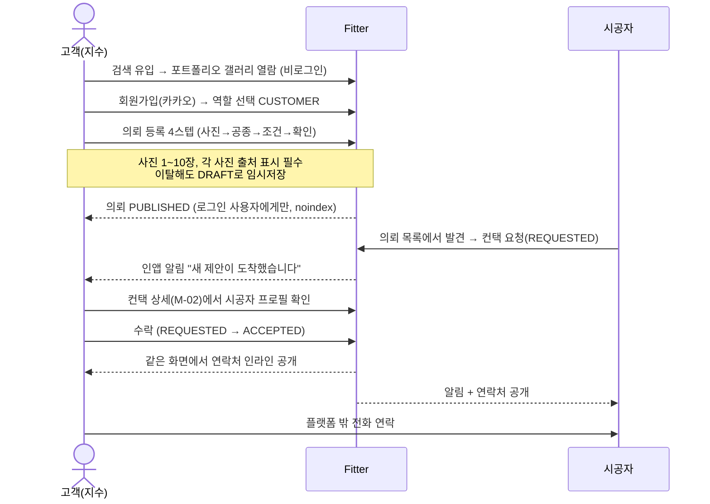
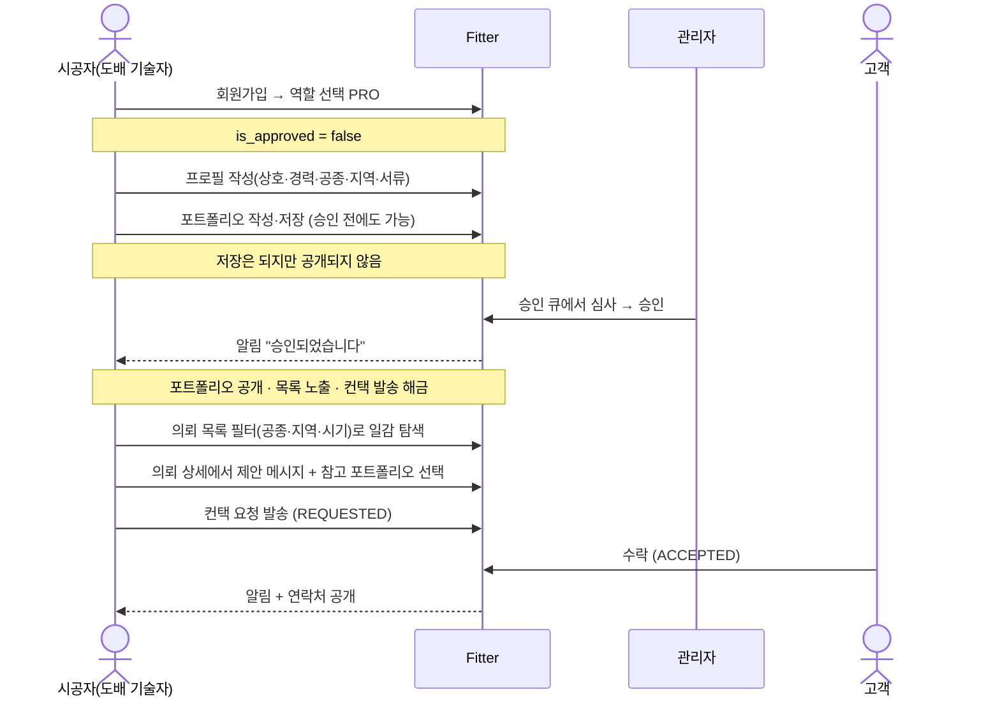

# PRD

> **[[P1 - 기획]] P1-1 산출물.** 이 볼트의 판단을 코드로 넘기기 위한 명세다.
> 이 문서는 **파생물이다.** 판단의 원본은 [[서비스 정의]] [[문제 정의]] [[MVP 범위]] 같은 원 노트에 있고, 여기는 그것을 구현 관점으로 재조립한 것이다. 충돌하면 **원 노트가 이긴다.**

반셀프 인테리어 매칭 플랫폼. 1인 개발.

볼트에 근거가 없는 내용은 **가정:** 으로 표시했고, 그 표시가 없는 문장은 모두 볼트에 근거가 있다. 기술 스택 결정은 [[ADR-001 - 기술 스택 선정]].

---

## 1. 문제 정의

양면 시장이므로 양쪽이 모두 아파야 서비스가 돈다. 두 고통은 성격이 다르다.

### 고객 측

**돈을 얼마나 더 냈는지 알 수 없다.** 종합업체 견적서는 항목이 뭉뚱그려져 있어 그 안에 얼마의 마진이 붙었는지 알 방법이 없다. 24평 도배·장판에 500만원이 적정한지 800만원이 적정한지 판단할 근거가 없고, 이 무지가 그대로 비용이 된다.

**원하는 것을 설명할 언어가 없다.** 실크 벽지와 합지의 차이를 모르는 채로 견적을 받는다. 그래서 업체가 제안하는 대로 끌려간다. "밝고 화이트톤에 우드 포인트"라는 말은 열 사람이 열 가지로 해석한다.

**작은 일감을 받아주지 않는다.** 도배만, 화장실만 하고 싶은데 종합업체는 부분 시공을 반기지 않거나 단가를 높게 부른다. 개인 시공자를 찾으려면 지역 카페와 지인 소개에 의존해야 하고, 그 사람의 실력을 확인할 방법이 없다.

### 시공자 측

**일감이 종합업체를 거쳐서만 온다.** 개인 기술자와 소규모 팀은 대부분 하청으로 일한다. 단가는 업체가 정하고 대금 지급도 업체 사정에 달려 있다. 고객이 낸 돈의 상당 부분이 자기에게 오지 않는 걸 알면서도 직접 고객을 만날 창구가 없다.

**실력을 보여줄 곳이 없다.** 20년 경력의 도배 기술자와 3개월 배운 사람이 온라인에서 구별되지 않는다. 작업 사진은 개인 카톡 프로필과 지역 카페 게시글에 흩어져 있다.

**성수기·비수기 편차가 크다.** 일감이 몰릴 땐 감당이 안 되고 없을 땐 몇 주씩 논다. 자기 조건(지역·공종·가능 시기)에 맞는 일감만 골라 볼 수 있으면 이 편차가 줄어든다.

### 두 고통의 관계

같은 구조에서 나온 두 얼굴이다. 기존 인테리어는 종합업체가 전 공정을 받아 각 공종 기술자에게 하청을 주는 턴키 구조이고, 고객이 내는 중간 마진과 시공자가 못 받는 단가는 **같은 돈**이다. 하이엔드라면 그 마진에 설계·감리·책임이라는 값어치가 붙지만, 무난하고 깔끔한 일반 인테리어에서는 그 대부분이 순수한 비용이다.

---

## 2. 해결 가설

**사진을 매개로 고객과 개인 시공자를 직접 연결하면, 고객은 중간 마진만큼 비용을 줄이고 시공자는 단가와 일감 선택권을 얻는다.**

### 왜 하필 사진인가

일반 고객은 인테리어를 말로 설명하지 못한다. 그런데 사진 한 장은 정확하다. 그래서 Fitter에서는 **고객이 올린 사진이 곧 요구사항 명세**다. 폼을 채우는 게 아니라 사진을 모아 올리면 그게 의뢰가 된다.

시공자 쪽도 대칭이다. 말이 아니라 자기가 실제로 한 작업 사진으로 자신을 증명한다. 양쪽 모두 사진으로 말하니 해석 차이가 줄어든다. 이건 부가 기능이 아니라 가설 그 자체다.

### 왜 양방향인가

한 방향만 있으면 매칭이 절반만 돈다. 시공자가 고객 의뢰를 보고 먼저 제안할 수 있고, 고객이 시공자 포트폴리오를 보고 먼저 문의할 수도 있다. 두 경로는 `ContactRequest`라는 하나의 개념으로 수렴하므로 도메인은 오히려 단순해진다.

양방향이 특히 중요한 실질적 이유는 콜드스타트다. 한 방향만 열면 그 방향의 재고가 0일 때 서비스가 멈추지만, 양방향이면 어느 한쪽만 채워져도 매칭이 시작될 수 있다.

### 이 가설의 약한 고리

**중간 마진이 사라지면 중간이 하던 일도 같이 사라진다.** 종합업체는 마진만 먹는 게 아니라 공정 조율, 품질 책임, 하자 보수, 분쟁 조정을 한다. 그걸 고객이 직접 떠안는다.

여기서 이 프로젝트의 진짜 문제가 나온다. 가격 신뢰와 콜드스타트가 이 가설의 두 급소이며, 9장에서 다룬다. **매칭 기능은 누구나 만든다. 이 프로젝트가 갈리는 지점은 그 두 급소를 어떻게 다루느냐다.**

---

## 3. 타겟 사용자 페르소나

> 볼트의 타겟 노트에는 성격·상황·이탈 지점이 정의되어 있으나 이름과 하루 일과는 없다. 아래 이름과 시간대별 서술은 **가정:** 이며, 서술을 구성하는 행동·동기·이탈 지점은 볼트에 근거가 있다.

### 페르소나 A — 지수 (고객)

**가정:** 32세, 성북구 24평 구축 아파트에 전세로 들어간다. 인테리어 예산이 빠듯해 전체를 뜯기보다 도배·장판·조명처럼 티가 나는 것만 골라 손보려 한다. 하이엔드를 원하지 않는다. 목표는 **"무난하고 깔끔하면 된다"** 이다. 인테리어 지식은 거의 없고 정보는 인스타그램과 오늘의집 사진에서 얻는다.

**하루 일과(가정:).** 출퇴근 지하철에서 인스타그램과 핀터레스트를 넘기며 마음에 드는 거실 사진을 캡처해 앨범에 모은다. 점심시간에 지역 맘카페에서 "성북구 도배 잘하는 곳" 검색을 하고, 저녁에 견적 비교 플랫폼에 폼을 채운다. 다음 날 낮에 모르는 번호로 전화가 서너 통 온다. 회의 중이라 못 받는다.

**현재 대안.** 지역 맘카페와 당근에서 업체를 찾거나 견적 비교 플랫폼에 폼을 넣고 전화를 받는다. 견적을 서너 개 받아도 항목이 제각각이라 비교가 안 된다. 결국 "그나마 말이 통하는 것 같은" 곳에 맡기고, 끝나고 나서 다른 사람은 더 싸게 했다는 걸 알게 된다.

**진짜 원하는 것.** "이 사진처럼 해주세요"가 그대로 통하는 것, 그리고 그게 얼마쯤인지 미리 아는 것. **두 번째는 MVP가 풀지 못한다.** 매칭만으로는 이 사람의 고통이 절반만 풀린다는 사실을 정직하게 인정하고 시작한다.

**이탈 지점.** 의뢰 등록 폼이 길면 이탈한다. 인테리어 용어로 물으면 이탈한다. 사진을 올렸는데 아무 반응이 없으면 이탈한다. 시공자 프로필에 판단 근거가 없으면 컨택하지 않는다.

### 페르소나 B — 도배 기술자 (시공자)

**가정:** 47세, 경력 11년의 도배 전문 개인 기술자. 성북·강북·노원에서 활동한다. 두세 명짜리 팀을 이룰 때도 있다. 공종이 특화되어 있고 종합업체 하청이 아니라 직접 일감을 받고 싶어 한다. 복잡한 웹 서비스에 익숙하지 않다.

**하루 일과(가정:).** 아침 7시 반 현장 도착, 종일 작업. 중간중간 완성된 벽면을 폰으로 찍어둔다. 점심때 업체에서 다음 주 일정 전화가 온다. 단가는 상대가 정한다. 저녁에 집에 와서 사진을 보지만 어디에 올려야 할지 몰라 갤러리에 그대로 둔다. 일감이 없는 주에는 하루 종일 연락을 기다린다.

**현재 대안.** 종합업체나 오래된 거래처에서 연락이 오면 간다. 가끔 지역 카페에 글을 올리지만 반응이 없다.

**진짜 원하는 것.** 자기 조건(지역·공종·가능 시기)에 맞는 일감만 골라 보는 것, 그리고 자기 실력이 제대로 보이는 것.

**이탈 지점.** 포트폴리오 등록이 복잡하면 안 올린다. 사진 15장을 하나씩 클릭해 올려야 하면 포기한다. 가입했는데 일감이 하나도 없으면 다시 안 온다. 승인 대기가 길면 잊어버린다.

**설계 함의.** 이 사람의 이탈률은 이미지 업로드 경험이 직접 좌우한다. 그래서 이미지 파이프라인은 부가 기능이 아니라 제품 그 자체다. 승인 대기 중에도 포트폴리오를 미리 작성할 수 있게 하는 이유도 같다 — 대기 시간을 빈 화면으로 두면 돌아오지 않는다.

---

## 4. 경쟁 분석과 포지셔닝

> 조사일 2026-07-25 기준. 출처는 각 서비스 공개 페이지와 업계 기사이며 볼트의 경쟁 지형 노트에 정리되어 있다.

**오늘의집(전문가·시공)** — 시공 사례 콘텐츠를 압도적으로 쌓고 그걸 지렛대로 무료 견적 상담을 붙인다. 사실상 콘텐츠 → 리드 → 업체 연결 퍼널이며, 커머스와 콘텐츠를 장악한 상태에서 시공으로 내려왔다. 이길 수 없는 영역은 콘텐츠 물량, 브랜드 인지도, 자재 커머스 연계다.

**집닥** — 비교견적 중개 특화. 고객 조건에 여러 업체 견적을 붙이고 안심 시공(하자보수·대금 보호)을 내세운다. 이길 수 없는 영역은 업체 네트워크 규모와 자본이 드는 보증 장치다.

**숨고** — 범용 고수 매칭이면서 인테리어도 다룬다. 주목할 점은 "도배·장판 시공 예상 견적" 같은 **가격 사전 공개 페이지를 이미 운영한다**는 것이다. 이건 양날이다. 가격 사전 공개가 시장에서 먹힌다는 검증이자, 동시에 그 방식이 우리만의 아이디어가 아니라는 뜻이다.

### 포지셔닝 표

| | 매칭 단위 | 입력 방식 | 가격 투명성 | 중개 마진 |
|---|---|---|---|---|
| 오늘의집 | 업체 | 폼 + 상담 | 없음 (상담 유도) | 있음 |
| 집닥 | 업체 | 폼 | 없음 (비교견적) | 있음 |
| 숨고 | 업체·개인 혼재 | 폼 | 시세 공개 | 있음 |
| **Fitter** | **개인 시공자 (공종 단위)** | **사진** | **MVP 없음 → 2차 범위 제시** | **없음 (일감비만)** |

### 빈틈 세 문장

첫째, **매칭 단위가 다르다.** 위 셋은 대부분 업체 단위 매칭이고 결국 종합업체가 받아간다. 공종 단위 개인 시공자에게 직접 꽂아주는 서비스는 얇다.

둘째, **입력 방식이 다르다.** 위 셋의 매칭 입력값은 폼 작성이다. Fitter는 고객이 올린 사진이 곧 요구사항 명세다. 말로 설명 못 하는 고객에게 이게 훨씬 자연스럽다.

셋째, **가격 투명성의 방향이 다르다.** 숨고가 "시세를 알려준다"라면 Fitter가 가려는 곳은 "이 조건에서는 이 범위를 벗어나면 안 된다"에 가깝다. 다만 이건 2차 과제이고 방향은 아직 확정되지 않았다.

**정직한 단서.** MVP 시점의 Fitter는 위 표에서 가격 투명성이 비어 있다. 즉 **경쟁 우위 셋 중 둘(매칭 단위·입력 방식)만으로 시작한다.** 세 번째는 데이터가 쌓여야 가능하고, 그 데이터를 받을 그릇을 지금 만드는 것이 이번 사이클의 숨은 목표다.

### 무엇이 아닌가

턴키 인테리어 중개가 아니다. 하이엔드 디자인 서비스가 아니다. 자재 커머스가 아니다. 인테리어 콘텐츠 미디어가 아니다. 이 넷은 모두 기존 플레이어가 이미 하고 있고 이길 수 없는 영역이다.

---

## 5. 핵심 사용자 여정

### 여정 1 — 고객: 가입에서 연락까지

이 여정의 급소는 **의뢰 등록 4스텝**이다. 여기서 이탈하면 나머지가 전부 무의미하므로, 스텝을 쪼개고 임시저장을 걸고 용어 대신 선택지로 묻는다.

### 여정 2 — 시공자: 가입에서 수락까지

이 여정의 급소는 **승인 대기 구간**이다. 대기 중 할 일이 없으면 돌아오지 않으므로 작성을 미리 허용하고, 승인 즉시 노출된다는 사실을 화면에서 알린다.

---

## 6. MVP 기능 명세

각 기능은 [사용자 가치] [수용 기준] [제외 범위] 순으로 쓴다. 수용 기준은 구현이 끝났는지 판정하는 기준이자 테스트 목록이다.

### 6.0 확정 범위와 기간 (2026-07-25 잠금)

[유저 스토리](user-stories.md)의 `Must` 30개를 보수적으로 환산한 결과 **413시간**이 나왔다. 4~6주(주 30시간 기준 120~180시간)의 2.3~3.4배다. 그래서 범위를 조정했다.

| | 값 |
|---|---|
| 확정 `Must` | **24개** (30개에서 6개 축소·제외) |
| 조정 후 추정 | **약 314시간** |
| **현실적 기간** | **약 10주** (주 30시간 기준) |

**기간 가정을 4~6주에서 8~10주로 수정한다.** 범위를 더 줄여 6주에 맞추는 것도 가능하지만, 그러려면 이미지 파이프라인이나 컨택 상태머신 중 하나를 포기해야 하고 그것은 이 프로젝트를 하는 이유를 포기하는 것이다.

잘라낸 것과 그 근거는 [백로그](backlog.md)에 있다. 요약하면 카카오 로그인, 관리자 화면 2개, 신고 플로우 분리, 시공자 목록 화면(C-06), 알림 목록 화면(G-04), 평수·주거형태 필터, 스크랩, 다크모드다.

**자르지 않은 것** — 이미지 파이프라인(F2·F3)과 컨택 상태머신(F5). 이 둘이 8장 성공 지표 그 자체다.

아래 F1~F6 명세는 축소 이전 기준으로 쓰여 있다. 축소된 항목은 각 절의 제외 범위가 아니라 백로그 문서를 정본으로 본다.

### F1. 인증과 역할

**사용자 가치.** 최소 마찰로 계정을 만들고, 자기 역할에 맞는 화면만 본다.

**수용 기준**
- Given 신규 방문자, When 카카오로 가입하면, Then 역할 선택 온보딩으로 이동하고 역할을 고르기 전에는 다른 보호 화면에 접근할 수 없다.
- Given 역할이 없는 계정, When 임의 보호 경로로 진입하면, Then 역할 선택 화면으로 강제 리다이렉트된다.
- Given `role = PRO`이고 `is_approved = false`인 계정, When 로그인하면, Then 프로필 작성·포트폴리오 작성·의뢰 목록 열람은 되고, 포트폴리오 공개·컨택 발송·시공자 목록 노출은 차단된다.
- Given `role = CUSTOMER`, When 관리자 API를 호출하면, Then 403을 받는다.
- Given ADMIN, When 가입 경로를 찾으면, Then 존재하지 않는다. ADMIN은 시드로만 생성된다.

**제외 범위.** 다중 역할 보유(계정당 역할 1개), 역할 자가 전환(설정에서 요청 → 관리자 수동 처리), 카카오 외 소셜 로그인.

### F2. 고객 — 레퍼런스 의뢰 등록

**사용자 가치.** 말로 설명하지 못하는 요구사항을 사진으로 정확히 전달한다.

**수용 기준**
- Given 의뢰 등록 화면, When 평수를 입력하면, Then 숫자로 저장된다(`area_pyeong DECIMAL`). 자유 텍스트 입력은 UI에 존재하지 않는다.
- Given 의뢰 등록 화면, When 지역을 고르면, Then 시도 코드와 시군구 코드로 저장되고 **주소 원문은 저장되지 않는다.**
- Given 공종 선택, When 다중 선택하면, Then `WorkCategory` FK로 저장된다. 한글 라벨 문자열 저장은 없다.
- Given 주거형태·자재등급·거주 중 여부, When 입력하면, Then 각각 enum 값으로 저장된다.
- Given 사진 업로드, When 각 사진의 출처를 고르면, Then `source_type`이 SELF 또는 EXTERNAL로 저장되고, **EXTERNAL이면 `source_url`이 필수이며 URL 형식을 검증한다.**
- Given 사진 1~10장 제한, When 초과하면, Then 클라이언트가 먼저 막고 서버가 다시 검증한다.
- Given 작성 중 이탈, When 다시 진입하면, Then DRAFT로 복원된다. **DRAFT는 어떤 목록에도 노출되지 않는다.**
- Given 의뢰가 PUBLISHED, When 비로그인 사용자가 접근하면, Then 로그인 벽으로 보내고 `noindex`가 적용된다.

**제외 범위.** 예산 범위는 선택 입력이며 미입력을 허용한다. `estimate_snapshot` 컬럼은 만들되 MVP에서는 항상 null이다.

### F3. 시공자 — 포트폴리오와 프로필

**사용자 가치.** 흩어져 있던 작업 사진을 한곳에 모아 실력을 증명한다.

**수용 기준**
- Given 모바일, When 사진을 여러 장 한 번에 선택하면, Then 개별 진행률·개별 취소·개별 재시도가 가능하다.
- Given 업로드, When 진행되면, Then 클라이언트가 먼저 리사이즈·압축하고 **EXIF 위치정보를 제거**한다.
- Given 사진 최대 15장, When 초과하면, Then 추가 버튼이 비활성화되고 사유가 표시된다.
- Given `is_cost_public = true`, When 저장하면, Then `actual_cost`가 공종·평수·시공연월·자재등급·지역 코드와 함께 정규화되어 저장된다.
- Given 포트폴리오가 PUBLISHED이고 소속 시공자가 `is_approved = false`, When 공개 목록을 조회하면, Then **노출되지 않는다.** 두 조건이 모두 필요하다.
- Given 승인 대기 중, When 포트폴리오를 작성·저장하면, Then 저장은 성공하고 공개만 보류된다.

**제외 범위.** 사진 `phase`(BEFORE/AFTER/PROCESS)는 스키마에 두되 등록 UI 유도는 최소한으로 한다. 동영상 업로드 없음.

### F4. 탐색과 필터

**사용자 가치.** 자기 조건에 맞는 것만 골라 본다.

**수용 기준**
- Given 모든 목록 API, When 조회하면, Then **커서 기반 페이지네이션**으로 응답한다. 오프셋 방식은 존재하지 않는다.
- Given 목록 화면, When 필터·정렬을 바꾸면, Then URL 쿼리스트링에 반영되어 공유·북마크·뒤로가기가 동작한다.
- Given 목록 화면, When 렌더링하면, Then 400px 썸네일만 로드한다. **원본은 목록 경로에 등장하지 않는다.**
- Given 필터 결과 0건, When 표시하면, Then "조건을 넓히세요" 계열 안내와 **동작하는 초기화 CTA**를 함께 준다.
- Given 서비스 전체 콘텐츠 0건, When 표시하면, Then 필터 0건과 **다른 화면**을 보여주고, 존재하지 않는 수치를 문장에 넣지 않는다.
- Given 포트폴리오 갤러리, When 비로그인으로 접근하면, Then 열람 가능하고 SSR로 색인된다.

**제외 범위.** 전문 검색엔진 연동 없음(Postgres 인덱스로 시작). 지도 기반 탐색 없음.

### F5. 컨택 — 양방향 매칭

**사용자 가치.** 마음에 든 상대와 실제로 연결된다.

**수용 기준**
- Given 컨택 요청, When 생성되면, Then 상태는 REQUESTED이며 요청자는 PRO 또는 CUSTOMER 어느 쪽이든 될 수 있다.
- Given REQUESTED, When 수신자가 수락하면, Then ACCEPTED로 전이하고 **같은 화면에서** 연락처가 인라인 공개된다.
- Given REQUESTED, When **요청자가** 수락을 시도하면, Then 도메인 에러를 던진다. 상태뿐 아니라 **주체까지 맞아야 한다.**
- Given REQUESTED, When 요청자가 취소하면 CANCELLED, 수신자가 거절하면 DECLINED, 7일 무응답이면 시스템이 EXPIRED로 보낸다.
- Given 종료 상태(ACCEPTED/DECLINED/CANCELLED/EXPIRED), When 어떤 전이든 시도하면, Then 실패한다. 마음이 바뀌면 새 요청을 만든다.
- Given 상태가 ACCEPTED가 아닌 컨택, When 상세·목록·프로필 어떤 API로 조회하든, Then **응답 JSON에 `phone` 키가 존재하지 않는다.** 값이 마스킹되는 게 아니라 키가 없다.
- Given 상태 전이, When 성공하면, Then 도메인 이벤트를 발행하고 알림은 그 이벤트를 구독한다. 상태머신이 알림을 직접 호출하지 않는다.
- Given 상태 전이 함수, When 테스트하면, Then 유효·무효 조합 **최소 15케이스**가 DB 없이 검증된다.
- Given 컨택 목록(M-01), When 조작하면, Then 상태를 바꾸는 수단이 없다. 전이는 상세(M-02)에서만 일어난다.

**제외 범위.** 인앱 채팅 없음. 컨택 만료 판정을 배치로 할지 조회 시점에 할지는 미결정(9장 참조).

### F6. 부가 — 스크랩·신고·알림·관리자

**사용자 가치.** 서비스가 최소한으로 운영 가능해진다.

**수용 기준**
- Given 저작권 신고, When 접수되면, Then 일반 신고와 **분리된 플로우**로 권리자 정보를 받고 `is_takedown_requested`가 설정되며 즉시 비공개 처리가 가능하다.
- Given 관리자 승인 큐, When 시공자를 승인하면, Then 해당 시공자의 포트폴리오가 공개되고 목록에 노출된다.
- Given 알림, When 컨택 상태가 바뀌면, Then 인앱 알림이 생성된다. 발송 채널은 어댑터 뒤에 있어 교체 가능하다.

**제외 범위.** 이메일·푸시·알림톡 실제 발송(MVP는 인앱 + 콘솔 구현). 리뷰·평점 없음.

---

## 7. 비기능 요구사항

### 이미지

의뢰 사진은 **1~10장**, 포트폴리오 사진은 **최대 15장**, 장당 **10MB**를 상한으로 한다. 허용 형식은 JPG·PNG·WebP·HEIC다.

> 시안 단계에서 의뢰 20MB / 포트폴리오 10MB로 갈라져 있었다. **이 문서의 10MB가 정본이며** 두 화면이 같은 값을 참조한다.

검증은 두 번 한다. 클라이언트에서 확장자·용량·개수를 먼저 거르는 것은 사용자 경험을 위해서이고, **서버에서 매직 넘버로 실제 파일 타입을 다시 확인하는 것이 진짜 방어선**이다. 클라이언트 검증은 우회할 수 있기 때문이다.

원본은 보관하되 목록용 400px와 상세용 1200px 썸네일을 파생한다. 업로드는 서명 URL로 스토리지에 직접 올라가며 **파일이 서버를 경유하지 않는다.** 업로드는 됐으나 메타데이터가 등록되지 않은 고아 파일은 TTL을 두고 정리한다.

### 성능

**가정:** 볼트에 수치 목표가 없어 아래는 이번 문서에서 처음 정하는 값이다.

목록 API 응답은 **p95 300ms 이내**(썸네일 전달 제외, 서버 처리 시간 기준)를 목표로 한다. 목록 화면의 LCP는 모바일 4G 기준 **2.5초 이내**를 목표로 한다. 근거는 사용자의 70% 이상이 모바일이고 목록이 느리면 고객이 이탈한다는 볼트의 판단이며, 수치 자체는 일반적인 웹 성능 기준을 차용한 것이다.

**가정:** 동시 접속은 포트폴리오 단계이므로 **동시 50명, 초당 20요청**을 설계 기준으로 잡는다. 이 수치를 넘기는 것이 목표가 아니라, 이 수치에서 커서 페이지네이션과 썸네일 전략이 실제로 동작함을 보이는 것이 목표다.

### 개인정보와 보안

주소는 **시군구 단위까지만** 저장하고 원문을 남기지 않는다. 상세 주소는 컨택 수락 이후 당사자끼리 직접 주고받는다. 이는 가격 계산을 위한 구조화 요구인 동시에 개인정보 최소 수집 원칙에 부합한다.

사진의 EXIF 위치정보는 업로드 시 제거한다. 고객의 집 좌표가 공개되면 심각한 사고다.

연락처는 컨택이 ACCEPTED일 때만 응답에 포함된다. 이 통제는 컨트롤러마다 조건문을 넣는 방식이 아니라 **응답 직렬화 레이어 한 곳에서** 강제한다. 기본값은 "포함하지 않음"이고 명시적으로 조건을 만족할 때만 채운다. 여러 곳에 흩뿌리면 어디가 진짜 방어선인지 알 수 없게 되고 그것이 보안 사고의 표준 경로다.

권한은 두 층으로 나누되 각각 한 곳에서만 강제한다. **역할 검사는 미들웨어(Guard)**, **소유자 검사는 서비스 레이어의 재사용 유틸**이다. 소유자 검사를 엔드포인트마다 따로 짜면 반드시 어딘가 빠진다.

**가정:** 탈퇴 시 개인 식별 정보는 즉시 파기하고 거래 이력은 익명화해 보존한다. 구체적 보존 기간은 법적 요건 확인 후 확정한다.

### 접근성

WCAG AA 대비율을 만족한다. 키보드만으로 핵심 플로우(의뢰 등록, 컨택 요청·수락)를 완주할 수 있어야 한다. 터치 타깃은 최소 44px이며, 포커스 링은 primary 버튼 위에서도 보여야 한다(시안에서 포커스색과 primary색이 같아 링이 보이지 않는 결함이 발견되었다). 다크모드를 지원한다.

---

## 8. 성공 지표

실사용자를 모으는 것이 목표가 아니므로 가입자 수나 매칭 건수는 지표가 되지 않는다. 대신 **기술적으로 증명하려는 것 세 가지**로 대체한다.

**첫째, 사진을 다루는 서비스를 제대로 만들 수 있다.** 서명 URL 직접 업로드, 클라이언트 리사이즈, 매직 넘버 기반 파일 타입 위조 방어, 썸네일 파생, EXIF 제거, 고아 파일 정리가 모두 동작한다. 판정 기준은 모바일에서 15장 업로드가 개별 취소·재시도와 함께 끝까지 완주되는 것, 그리고 목록 응답에 원본 URL이 한 번도 등장하지 않는 것이다.

**둘째, 상태와 권한을 코드로 강제할 수 있다.** 컨택 상태 전이가 도메인 레이어의 순수 함수로 분리되어 DB 없이 테스트되고, 주체 검증까지 포함해 최소 15개 유효·무효 조합이 통과한다. 그리고 **ACCEPTED 이전 어떤 응답에도 `phone` 키가 없다는 것이 테스트로 증명된다.** 화면에서 안 보이는 것과 응답에 없는 것은 완전히 다르다.

**셋째, 확장을 위한 경계를 실제로 그었다.** 도메인 레이어의 import 문에 프레임워크 이름이 하나도 없고, 스토리지·알림·검색·견적이 모두 포트 인터페이스 뒤에 있으며, 모든 목록이 커서 기반이고, `EstimatePolicy`와 `estimate_snapshot`이 2차를 위해 비어 있는 채로 자리를 잡고 있다. 판정 기준은 최종 리뷰에서 이 네 가지를 코드로 확인하는 것이다.

이 셋은 면접에서 파고들 지점과 정확히 일치한다. 지표를 이렇게 잡는 이유가 그것이다.

---

## 9. 리스크와 완화책

### R1. 가격 신뢰 — 치명적

중간 마진을 없앤 대가로 **가격 통제도 사라진다.** 지식이 없는 고객은 제시된 금액이 적정한지 판단할 수단이 없고, 시공자가 덤터기를 씌워도 알 수 없다. 오히려 종합업체보다 비싸게 낼 수도 있으며 그러면 서비스의 존재 이유가 사라진다. 완전 정찰제는 불가능하다 — 같은 24평이라도 자재 등급, 철거 유무, 층수와 엘리베이터, 거주 여부, 지역 인건비, 시공 시기가 가격을 가른다.

**완화.** MVP에서는 **아무것도 구현하지 않는다. 대신 데이터를 제대로 받는다.** 평수를 숫자로, 공종을 코드 테이블로, 지역을 행정구역 코드로, 자재등급을 enum으로 받으면 나중에 단가표만 얹어 자동 견적이 나온다. 여기에 고객의 예산 범위 입력과 시공자의 실제 비용 공개라는 수집 통로 둘을 열어둔다. **기능은 나중에 붙일 수 있지만 안 받은 데이터는 소급되지 않는다.** 잠정 방향은 시세 공개(B)로 시작해 실거래가 집계(D)로 가고 최종적으로 구간 강제(A)를 얹는 단계 전략이며, 순서 타당성은 2차에서 검토한다.

### R2. 콜드스타트 — 치명적

의뢰가 없으면 시공자가 안 오고 시공자가 없으면 고객이 안 온다. 둘 다 없는 상태에서 시작한다.

**완화.** 화면 차원에서 모든 목록이 0건 상태의 **의도된 디자인**을 갖는다. 여기에 시안 검수에서 도출한 규칙을 더한다 — 필터 0건과 콘텐츠 0건을 다른 화면으로 분기하고, 빈 상태의 숫자는 실제 카운트에서 계산하며(하드코딩된 숫자는 출시 첫날 거짓말이 된다), CTA는 반드시 화면을 바꾸고, 콘텐츠 0건일 때는 히어로 카피까지 모집 모드로 바꾼다. 제품 차원에서는 시공자 쪽을 먼저 채우고(포트폴리오 등록은 자기 홍보라는 즉시 보상이 있다) 지역을 한 개 구로 좁혀 밀도를 올리며, 포트폴리오 갤러리를 비로그인에 열어 검색 유입을 만든다. 포트폴리오 프로젝트로서의 실질적 완화는 **시드 데이터의 품질**이다. 심사자가 로그인했을 때 텅 빈 화면을 보면 안 되고 "테스트1, 테스트2"를 써서도 안 된다.

### R3. 레퍼런스 사진 저작권 — 높음

**핵심 기능이 곧 침해 유발 구조다.** 고객이 올리는 사진 대부분은 핀터레스트·인스타그램·오늘의집에서 퍼온 남의 저작물이다. 서비스가 조금만 커지면 권리자 항의가 들어온다.

**완화.** 출처를 구조적으로 강제한다 — 사진마다 `source_type`을 받고 EXTERNAL이면 `source_url`을 필수로 하며 형식을 검증한다. 등록 화면과 상세에 목적과 출처를 고지한다. 권리자 신고 시 즉시 비공개 처리하는 경로를 MVP에 포함하고 일반 신고와 분리한다. 그리고 **의뢰 자체를 로그인 벽 뒤에 두고 `noindex`를 건다.** 포트폴리오는 열고 의뢰는 닫는 비대칭이 여기서 나온다 — 포트폴리오 사진은 시공자 본인의 작업물이라 공개 권리를 확보할 수 있지만 의뢰 사진은 그렇지 않다.

### R4. 플랫폼 이탈 — 높음

연락처를 교환하면 이후 대화와 거래는 플랫폼 밖에서 일어난다. 수수료를 받을 지점이 없어지고, 더 아픈 것은 **실제 계약 금액이 남지 않는다는 것**이다. 그 데이터가 R1을 푸는 원재료이므로 이탈은 가격 문제까지 막는다.

**완화.** MVP에서는 감수한다. 인앱 채팅과 결제는 범위 밖이다. 다만 씨앗은 심는다 — 시공자가 실제 비용을 공개하면 신뢰도 뱃지를 주는 구조가 자발적 데이터 회수 통로다. **강제가 아니라 유인으로 접근한다.** 연락처 열람 시점을 기록해 이탈 지표로 쓴다.

### R5. 확장 규약 위반이 시안에 이미 존재함 — 높음

시안 검수에서 평수·지역이 자유 텍스트 입력이고, 의뢰 사진의 출처 필드가 아예 없으며, 공종 목록이 화면마다 다섯 갈래로 갈라져 있음이 확인되었다. 시안은 그림이 아니라 폼의 명세이므로 이대로 구현하면 R1의 완화책이 통째로 무력화된다.

**완화.** 6장 F2·F3의 수용 기준이 이 항목들을 명시적으로 못 박았다. ERD 설계 시점과 최종 리뷰 시점에 두 번 확인한다. 공종은 단일 코드 테이블로 뽑아 모든 화면이 그것만 참조하게 한다.

### R6. 시공 품질 편차와 책임 소재 — 중간

개인 시공자는 실력 편차가 크고 하자 시 책임 소재가 불분명하다. 종합업체가 하던 품질 책임과 분쟁 조정이 사라진 자리다.

**완화.** MVP에서는 관리자 수동 승인과 신고 기능으로만 대응한다. 화면에는 판단 근거(승인 뱃지·경력·시공 건수·활동 지역·비용 공개 여부)를 목록 단계에서부터 노출한다. 그리고 **플랫폼이 계약 당사자가 아님을 명시한다.** 실질적 신뢰 장치는 2차로 미룬다.

### R7. 스팸과 어뷰징 — 중간

시공자가 모든 의뢰에 무차별 제안을 보내면 고객 경험이 무너진다.

**완화.** 하루 요청 개수 제한과 동일 대상 중복 요청 차단. **가정:** 구체적 상한값은 구현 시점에 정한다.

### R8. 범위 폭발 — 중간

혼자 4~6주라는 가정을 넘기면 완성 자체가 위험해진다. 화면 21개, 기능 6묶음은 1인 4~6주에 빠듯하다.

**완화.** 화면 수 상한 25개를 잠갔고 만들지 않을 것을 명시적으로 목록화했다. 범위 재조정은 P1-3에서 개발 시간을 추정해 다시 판단한다. 다만 **이미지 파이프라인과 컨택 상태머신 둘은 범위를 줄이더라도 남긴다.** 이 둘이 8장의 성공 지표 그 자체이기 때문이다.

### 미결정 사항

컨택 만료(7일 무응답)를 배치로 밀어넣을지 조회 시점에 판정할지 정해지지 않았다. 계정당 역할 1개는 잠정 결정이며 스키마는 다중 역할로 열어둔다. 비용 공개를 불리언으로 끝낼지 범위까지 보여줄지도 미정이다.

---

## 10. 2차 로드맵

MVP에서 만들지 않는 것들과 그 이유다. **하지만 설계가 이것들을 막으면 안 된다.**

**가격 산출(자동 견적).** 데이터가 없으면 계산이 불가능하다 — 단가표의 정확도가 전부를 좌우하는데 그 근거가 되는 실거래 데이터가 아직 0건이다. 이번 사이클의 확장 규약 다섯 조항과 `EstimatePolicy` 인터페이스, `estimate_snapshot` 컬럼이 전부 이 기능의 자리를 미리 비워둔 것이다.

**리뷰·평점.** 거래 검증 없이는 신뢰도가 없다 — 플랫폼이 실제 계약 여부를 알 수 없는 상태에서 받는 평점은 조작에 무방비다. 거래 데이터가 먼저다(R4와 맞물린다).

**안전결제·에스크로.** 전자금융업 등록 등 법적 요건이 필요해 개인 프로젝트로는 불가능하다.

**인앱 채팅.** 연락처 공개로 대체 가능하므로 구현 비용 대비 MVP 가치가 낮다. 다만 R4의 이탈을 막는 가장 직접적 수단이라 2차에서는 우선순위가 올라간다.

**표준 계약서·전자서명, 일정·공정 관리.** 전자는 2차 신뢰 장치의 일부이고, 후자는 범위 폭발 위험이 크다.

**신뢰 장치 종합 설계.** R6의 실질적 해법으로, 거래를 플랫폼 안에 묶는 네 가지 수단(채팅·결제·계약서·리뷰) 중 무엇을 어떤 순서로 놓을지 별도 검토가 필요하다.

---

## 부록 — 이 PRD에서 가장 약한 논리 셋

자기 비판이다. 읽는 사람이 먼저 찌를 지점을 먼저 적는다.

**하나. 가격 문제를 2차로 미루면서 그것이 "이 프로젝트의 진짜 핵심 문제"라고 말하고 있다.** 2장에서 고객의 진짜 요구가 "이 사진처럼 해주세요"와 "그게 얼마인지 아는 것" 둘이라고 정의해놓고, MVP는 첫 번째만 푼다. 그러면 이 MVP는 페르소나 A의 고통을 절반만 푸는 제품이고, 4장 포지셔닝 표의 세 축 중 하나가 비어 있는 채로 출시된다. "데이터를 쌓아 2차에 푼다"는 답은 논리적으로는 맞지만 **순환 논증의 위험**이 있다 — 가격을 못 풀어서 사용자가 안 오면 데이터도 안 쌓이고, 데이터가 없으면 가격을 못 푼다. 지금 이 문서는 그 고리를 끊을 방법을 제시하지 못한다. 포트폴리오로서는 성립하지만 사업 계획으로서는 여기가 가장 약하다.

**둘. 콜드스타트 완화책 대부분이 실제로는 완화가 아니라 연기다.** "시공자를 먼저 채운다", "지역을 좁힌다", "SEO로 유입을 만든다"는 모두 **실행이 필요한 계획이지 설계가 보장하는 속성이 아니다.** 그리고 포트폴리오 프로젝트에서는 셋 다 실행되지 않는다 — 실제 시공자를 모으지 않기 때문이다. 남는 유일한 실질적 대응이 "시드 데이터의 품질"인데, 이건 콜드스타트를 푸는 게 아니라 **심사자에게 콜드스타트가 안 보이게 하는 것**이다. 그 차이를 이 문서는 얼버무리지 않고 인정해야 한다.

**셋. 성능·동시접속 수치와 페르소나의 하루 일과가 근거 없이 도입되었다.** 7장의 p95 300ms, LCP 2.5초, 동시 50명은 볼트 어디에도 없고 일반적 관행에서 빌려온 값이다. 3장의 하루 일과도 마찬가지로 만들어낸 서사다. 둘 다 **가정:** 으로 표시했으니 정직성은 지켰지만, 표시했다고 해서 근거가 생기는 것은 아니다. 특히 성능 목표는 이후 최적화 작업의 판정 기준이 되므로, 실제 시드 데이터로 한 번 측정한 뒤 현실적인 값으로 갱신해야 한다. 그 전까지 이 수치들은 목표가 아니라 **자리 표시자**로 취급하는 게 맞다.

## 연결

[[유저 스토리]] · [[백로그]] · [[ADR-001 - 기술 스택 선정]] · [[서비스 정의]] · [[문제 정의]] · [[MVP 범위]] · [[경쟁 지형]] · [[리스크 레지스터]] · [[확장 규약]] · [[구조적 원칙]] · [[이미지 파이프라인]] · [[상태머신 - 컨택]] · [[시안 검수 결과]] · [[P1 - 기획]] · [[진행 현황판]]
