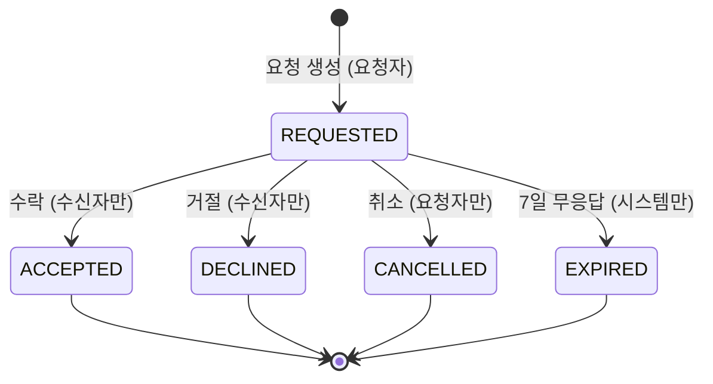

# 유저 스토리

> **[[P1 - 기획]] P1-2 산출물.** [[PRD]]의 기능 명세를 구현·테스트 단위로 쪼갠 것이다.
> **수용 기준은 그대로 테스트 목록이 된다.** 구현이 끝났는지는 여기서 판정한다.

엔티티 정의의 원본은 [[엔티티 - ReferenceRequest]] [[엔티티 - PortfolioItem]] [[엔티티 - ContactRequest]] [[엔티티 - User와 역할]] [[엔티티 - WorkCategory]]에 있고, 전이 규칙은 [[상태머신 - 컨택]], 권한 원칙은 [[권한 모델]]에 있다. 충돌하면 그쪽이 이긴다.

**우선순위 표기** — `Must` 없으면 MVP가 성립하지 않음 · `Should` 있어야 제품답지만 미루면 미룰 수 있음 · `Could` 여유가 있으면.

**완료 규칙** — 모든 `Must` 스토리는 Given/When/Then 3개 이상과 예외 케이스 2개 이상을 갖는다.

---

## 용어와 상수 (모든 스토리가 참조하는 정본)

여기 있는 값이 정본이다. 화면마다 다른 값을 들고 있으면 그 화면이 틀린 것이다. 시안 단계에서 공종 목록이 다섯 갈래로, 이미지 용량이 두 갈래로 갈라져 있었기 때문에 명시한다.

| 항목 | 값 |
|---|---|
| 역할 | `CUSTOMER` / `PRO` / `ADMIN` (계정당 하나) |
| 컨택 상태 | `REQUESTED` / `ACCEPTED` / `DECLINED` / `CANCELLED` / `EXPIRED` |
| 의뢰 상태 | `DRAFT` / `PUBLISHED` / `CLOSED` / `HIDDEN` |
| 주거형태 | `APARTMENT` / `VILLA` / `OFFICETEL` / `HOUSE` / `COMMERCIAL` |
| 자재등급 | `BASIC` / `STANDARD` / `PREMIUM` |
| 사진 출처 | `SELF` / `EXTERNAL` |
| 사진 단계(포트폴리오) | `BEFORE` / `AFTER` / `PROCESS` |
| 공종 시드 13종 | 도배, 장판·마루, 타일, 욕실, 주방, 목공, 필름, 페인트, 조명·전기, 새시·중문, 철거, 줄눈, 입주청소 |
| 이미지 상한 | 의뢰 1~10장 · 포트폴리오 최대 15장 · **장당 10MB** |
| 허용 형식 | JPG · PNG · WebP · HEIC |
| 썸네일 | 목록 400px · 상세 1200px |
| 컨택 만료 | 7일 무응답 |

공종은 `WorkCategory` 테이블의 `code`로 참조한다. 한글 라벨을 저장하는 코드는 어디에도 없다.

---

## E1. 인증과 역할

### US-001 소셜·이메일 회원가입 — `Must` — G-02

나는 **방문자**로서 **최소한의 마찰로 서비스를 시작하기 위해** 카카오 또는 이메일로 가입하기를 원한다.

**수용 기준**
- Given 비로그인 방문자, When 카카오 로그인을 완료하면, Then 계정이 생성되고 `provider = KAKAO`, `password_hash = null`로 저장된다.
- Given 비로그인 방문자, When 이메일과 비밀번호로 가입하면, Then `provider = LOCAL`로 저장되고 비밀번호는 해시로만 보관된다.
- Given 가입 완료, When 역할이 아직 없으면, Then G-03 역할 선택으로 이동한다.
- Given 약관 동의 체크박스가 해제된 상태, When 가입을 시도하면, Then 차단되고 사유가 표시된다.

**예외 케이스**
- 이미 가입된 이메일로 재가입 시도 → 중복 안내와 로그인 유도(계정 존재 여부를 노출하는 범위는 보안 관례에 따라 최소화).
- 카카오 인증 창에서 사용자가 취소 → 원래 화면으로 복귀하며 계정을 만들지 않는다.
- 소셜로 가입한 이메일과 같은 주소로 이메일 가입 시도 → 기존 소셜 로그인으로 안내.

### US-002 역할 선택 온보딩 — `Must` — G-03

나는 **새 사용자**로서 **내게 맞는 화면만 보기 위해** 고객과 시공자 중 하나를 고르기를 원한다.

**수용 기준**
- Given 역할이 없는 계정, When 어떤 보호 화면으로 진입하든, Then G-03으로 강제 리다이렉트된다.
- Given G-03, When `CUSTOMER`를 확정하면, Then 역할이 저장되고 C-01(의뢰 등록)로 이동한다.
- Given G-03, When `PRO`를 확정하면, Then 역할이 저장되고 `is_approved = false` 상태로 P-01(프로필 편집)로 이동한다.
- Given 역할 확정, When 사용자가 스스로 역할을 바꾸려 하면, Then 불가능하며 G-05의 전환 요청(관리자 수동 처리) 경로만 제공된다.

**예외 케이스**
- 역할 선택 중 뒤로가기로 이탈 → 다음 진입 시 G-03이 다시 강제된다.
- 저장 요청 실패(네트워크) → 선택이 화면에 유지된 채 재시도 버튼이 뜬다. 선택이 초기화되지 않는다.

**참고.** 계정당 역할 1개는 잠정 결정이다. 스키마는 `User 1—N UserProfile` 구조로 열어두고 애플리케이션 레벨에서 1개로 제한한다.

### US-003 미승인 시공자 권한 제한 — `Must` — P-01, P-02, P-03, P-04

나는 **플랫폼**으로서 **검증되지 않은 시공자가 고객에게 노출되지 않도록** 승인 전 기능을 제한하기를 원한다.

**수용 기준**
- Given `role = PRO`이고 `is_approved = false`, When 로그인하면, Then 프로필 작성·포트폴리오 작성과 저장·의뢰 목록 열람이 **가능하다.**
- Given 같은 계정, When 포트폴리오를 `PUBLISHED`로 두어도, Then 공개 목록(C-04)에 노출되지 않는다.
- Given 같은 계정, When 컨택 요청 발송을 시도하면, Then 차단되고 승인 대기 안내가 표시된다.
- Given 같은 계정, When 시공자 목록(C-06)을 조회하면, Then 해당 계정은 결과에 포함되지 않는다.
- Given 관리자가 승인, When `is_approved = true`가 되면, Then 별도 조작 없이 포트폴리오가 공개되고 목록에 나타난다.

**예외 케이스**
- 승인 후 관리자가 승인을 철회 → 공개가 즉시 중단되고 진행 중인 컨택은 유지된다(이미 공개된 연락처는 회수하지 않는다).
- 미승인 상태에서 API를 직접 호출 → UI 차단과 무관하게 서버가 403을 반환한다.

### US-004 관리자 권한 격리 — `Must` — A-01, A-02

나는 **플랫폼**으로서 **관리 기능이 새어나가지 않도록** 일반 사용자의 관리자 API 접근을 차단하기를 원한다.

**수용 기준**
- Given `role`이 `CUSTOMER` 또는 `PRO`, When 관리자 API를 호출하면, Then 403을 반환한다.
- Given 어떤 가입 경로로도, When `ADMIN` 역할을 얻으려 하면, Then 불가능하다. `ADMIN`은 시드로만 생성된다.
- Given `ADMIN`, When 관리자 화면에 접근하면, Then A-01·A-02를 사용할 수 있다.

**예외 케이스**
- 비로그인 상태로 관리자 URL 직접 접근 → 401 또는 로그인 화면. 관리자 화면의 존재를 추측할 정보를 노출하지 않는다.
- 권한이 강등된 세션이 남아 있는 경우 → 다음 요청에서 즉시 거부된다.

### US-005 설정과 탈퇴 — `Should` — G-05

나는 **사용자**로서 **내 계정을 관리하기 위해** 알림 수신과 탈퇴를 설정하기를 원한다.

**수용 기준**
- Given G-05, When 알림 수신을 토글하면, Then 저장되고 이후 알림 생성에 반영된다.
- Given 진행 중인 컨택(`REQUESTED`)이 있는 계정, When 탈퇴를 시도하면, Then 차단하고 사유를 안내한다.
- Given 탈퇴 확정, When 처리되면, Then 개인 식별 정보는 파기하고 이력은 익명화해 남긴다.

**예외 케이스**
- 탈퇴 확인 모달에서 취소 → 아무것도 변경되지 않는다.
- 탈퇴한 사용자가 상대인 컨택 → 상대 화면에 "상대 계정이 삭제되어 처리할 수 없습니다"가 표시된다(US-046 참조).

---

## E2. 고객 — 레퍼런스 의뢰 등록

### US-010 사진으로 의뢰 시작하기 — `Must` — C-01(스텝 1)

나는 **고객**으로서 **말로 설명하지 못하는 요구를 전달하기 위해** 원하는 인테리어 사진을 올려 의뢰를 시작하기를 원한다.

**수용 기준**
- Given C-01 스텝 1, When 사진을 여러 장 선택하면, Then 각 사진이 개별 진행률과 함께 병렬 업로드되고 개별 취소·개별 재시도가 가능하다.
- Given 사진 1장 이상, When 업로드가 끝나면, Then 첫 사진이 기본 대표로 지정되고 순서 변경과 대표 재지정이 가능하다.
- Given 사진 0장, When 다음 단계로 넘어가려 하면, Then **버튼이 시각적으로 비활성(회색 + `not-allowed`)이고 사유가 표시된다.** 눌러야 에러가 나는 방식이 아니다.
- Given 사진 10장, When 추가를 시도하면, Then 추가 버튼이 비활성화되고 상한이 표시된다.
- Given 업로드 중, When 화면을 벗어났다 돌아오면, Then 진행 상태가 복원되거나 명확히 실패로 표시된다. 조용히 사라지지 않는다.

**예외 케이스**
- 10MB 초과 파일 → 해당 파일만 실패로 표시하고 나머지는 계속 진행한다. 전체가 중단되지 않는다.
- 확장자를 위조한 파일(`.jpg`로 바꾼 실행 파일) → 서버 매직 넘버 검증에서 거부된다.
- 업로드 도중 네트워크 단절 → 진행이 멈추고 "연결되면 이어서" 안내 후 재개 또는 재시도가 가능하다.

### US-011 사진 출처 표시와 URL 검증 — `Must` — C-01(스텝 1)

나는 **플랫폼**으로서 **저작권 분쟁에 대응하기 위해** 사진마다 출처를 구조적으로 받기를 원한다.

> **이 스토리는 리스크 대응의 핵심이다.** 고객이 올리는 사진 상당수는 인터넷에서 가져온 남의 저작물이다. 전역 동의 체크박스 하나로는 출처를 되짚을 수 없다.

**검증 로직 (순서대로)**

```
사진마다:
  source_type ∈ {SELF, EXTERNAL}  — 미선택이면 다음 단계 진행 차단
  IF source_type == EXTERNAL:
      source_url 필수                      → 비어 있으면 거부
      URL 형식 검증 (http/https 스킴)       → 위반이면 거부
      길이 상한 검증                        → 초과면 거부
      서버에서 동일 검증 재수행              → 클라이언트 우회 방지
  IF source_type == SELF:
      source_url 은 null 로 저장 (빈 문자열 아님)
```

**수용 기준**
- Given 사진 타일, When 출처를 고르지 않으면, Then 다음 단계로 넘어갈 수 없고 어느 사진이 미선택인지 표시된다.
- Given `source_type = EXTERNAL`, When `source_url`이 비어 있으면, Then 저장이 거부되고 해당 사진에 오류가 표시된다.
- Given `source_type = EXTERNAL`, When `source_url`이 URL 형식이 아니면, Then 형식 오류로 거부된다.
- Given `source_type = SELF`, When 저장하면, Then `source_url`은 `null`로 저장된다.
- Given 클라이언트 검증을 우회한 요청, When 서버가 받으면, Then 서버에서 동일한 규칙으로 다시 거부한다.
- Given 의뢰 상세, When 외부 출처 사진을 보면, Then 출처 링크가 함께 표시된다.

**예외 케이스**
- 출처 URL이 접근 불가(404)여도 저장은 허용한다. 링크 생존 여부는 검증 범위 밖이며 형식만 본다.
- 사진을 삭제 후 재업로드 → 출처 선택이 초기화되고 다시 요구된다. 이전 값이 잘못 승계되지 않는다.

### US-012 구조화된 조건 입력 — `Must` — C-01(스텝 2~3)

나는 **고객**으로서 **용어를 몰라도 조건을 정확히 전달하기 위해** 선택지와 숫자로 조건을 입력하기를 원한다.

> **확장 규약 위반을 막는 스토리다.** 시안에는 평수와 지역이 자유 텍스트 입력으로 들어 있었다. 이대로 구현되면 2차 가격 기능이 영구히 불가능해진다.

**수용 기준**
- Given 평수 입력, When 값을 넣으면, Then `area_pyeong`에 **숫자로** 저장되고 `area_m2`가 파생된다. 자유 텍스트 입력 컨트롤은 화면에 존재하지 않는다.
- Given 지역 입력, When 시도와 시군구를 고르면, Then `sido_code`·`sigungu_code`로 저장되고 **주소 원문은 저장되지 않는다.**
- Given 공종 선택, When 여러 개를 고르면, Then `WorkCategory` FK N:M으로 저장된다. 한글 라벨 문자열은 저장되지 않는다.
- Given 주거형태·자재등급·거주 중 여부, When 선택하면, Then 각각 enum 값으로 저장되고 화면 라벨이 아니라 enum 키가 전송된다.
- Given 희망 시기, When 선택하면, Then `desired_start_at`·`desired_end_at` 날짜로 저장된다.
- Given 예산 범위, When 입력하지 않으면, Then 그대로 진행된다(선택 항목).

**예외 케이스**
- 평수에 0 또는 음수, 비현실적 값(예: 1000평 초과) → 범위 검증에서 거부된다.
- 공종을 하나도 고르지 않음 → 허용하되 "시공자 제안에 맡김"으로 명시 저장한다. 빈 값과 구분한다.
- 자재등급 미선택 → `null` 허용. 이후 통계에서 결측으로 처리된다.

### US-013 임시저장과 복원 — `Must` — C-01

나는 **고객**으로서 **중간에 끊겨도 다시 쓰지 않기 위해** 작성 중인 의뢰가 저장되기를 원한다.

**수용 기준**
- Given 작성 중, When 스텝을 넘기거나 일정 시간이 지나면, Then 서버에 `DRAFT`로 저장된다.
- Given `DRAFT` 의뢰, When 어떤 목록 API를 조회하든, Then **결과에 포함되지 않는다.**
- Given `DRAFT`가 있는 사용자, When 다시 C-01에 진입하면, Then 복원 안내와 함께 이어쓰기를 제안한다.
- Given 복원 제안, When 새로 시작을 고르면, Then 기존 `DRAFT`는 폐기된다.

**예외 케이스**
- `DRAFT`가 여러 개 쌓임 → 가장 최근 것 하나만 이어쓰기 대상으로 노출한다.
- 임시저장 요청 실패 → 작성 내용은 화면에 유지되고 실패가 조용히 무시되지 않는다.

### US-014 의뢰 공개와 색인 차단 — `Must` — C-01(스텝 4), C-03

나는 **플랫폼**으로서 **저작권 리스크를 줄이기 위해** 의뢰를 로그인 사용자에게만 보이고 검색 색인에서 제외하기를 원한다.

**수용 기준**
- Given 의뢰가 `PUBLISHED`, When 비로그인 사용자가 접근하면, Then 로그인 화면으로 유도된다.
- Given 의뢰 상세·목록 페이지, When 렌더링되면, Then `noindex` 메타가 포함된다.
- Given 승인된 시공자, When 의뢰 목록(P-04)을 조회하면, Then `PUBLISHED` 의뢰만 보인다.
- Given 의뢰가 `CLOSED` 또는 `HIDDEN`, When 목록을 조회하면, Then 포함되지 않는다.

**예외 케이스**
- 삭제된 의뢰의 URL 직접 접근 → 404 대신 "내려간 의뢰입니다" 설명 화면.
- 마감된 의뢰에 제안 시도 → 차단되고 마감 상태가 표시된다.

### US-015 내 의뢰 목록과 제안 확인 — `Must` — C-02, C-03

나는 **고객**으로서 **어떤 반응이 왔는지 확인하기 위해** 내 의뢰와 받은 제안을 보기를 원한다.

**수용 기준**
- Given C-02, When 진입하면, Then 내 의뢰가 상태 뱃지·썸네일·받은 제안 수와 함께 표시된다.
- Given 의뢰가 0건, When C-02를 보면, Then 등록 유도 빈 상태가 표시된다(콜드스타트 핵심 화면).
- Given C-03, When 받은 제안이 있으면, Then 시공자 요약 카드 목록으로 비교할 수 있다.
- Given 받은 제안이 0건, When C-03을 보면, Then "아직 제안이 없습니다 — 시공자를 직접 찾아보세요"와 C-06 링크가 표시된다.

**예외 케이스**
- 목록 조회 실패 → 재시도 가능한 오류 화면. 빈 상태와 오류 상태를 구분해 표시한다.
- 의뢰 마감 후 새 제안 도착(경쟁 상태) → 제안은 거부되고 마감 사실이 안내된다.

### US-016 의뢰 수정·마감 — `Should` — C-03

나는 **고객**으로서 **상황이 바뀌었을 때** 의뢰를 수정하거나 마감하기를 원한다.

**수용 기준**
- Given 내 의뢰, When 수정하면, Then 저장되고 목록에 반영된다.
- Given 내 의뢰, When 마감하면, Then `CLOSED`가 되어 목록에서 사라지고 신규 제안이 차단된다.
- Given 남의 의뢰, When 수정·마감을 시도하면, Then 소유자 검사에서 403이 반환된다.

**예외 케이스**
- 진행 중인 컨택이 있는 의뢰를 마감 → 기존 컨택은 유지되며 마감 사실만 반영된다.
- 동시 수정 충돌 → 마지막 저장이 이기되 사용자에게 갱신 사실을 알린다.

---

## E3. 시공자 — 프로필과 포트폴리오

### US-020 프로필 작성과 완성도 — `Must` — P-01

나는 **시공자**로서 **고객이 나를 판단할 근거를 주기 위해** 프로필을 채우기를 원한다.

**수용 기준**
- Given P-01, When 상호·소개·경력 연차·보유 공종·활동 지역을 입력하면, Then 저장된다. 공종은 FK, 지역은 시도·시군구 코드다.
- Given 필수 항목 누락, When 저장을 시도하면, Then 차단되고 누락 항목이 표시된다.
- Given 프로필 작성, When 항목을 채울수록, Then 완성도 게이지가 올라가고 노출 가산 효과가 안내된다.
- Given 미승인 상태, When P-01에 진입하면, Then 상단에 승인 상태 배너가 표시된다.

**예외 케이스**
- 승인 반려 → 사유가 배너에 표시되고 재제출 경로가 열린다.
- 사업자등록번호 미입력 → 선택 항목이므로 저장은 되지만 완성도에 반영된다.

### US-021 포트폴리오 다중 사진 업로드 — `Must` — P-02

나는 **시공자**로서 **현장에서 빠르게 실적을 남기기 위해** 사진 여러 장을 한 번에 올리기를 원한다.

> **이 스토리가 시공자 이탈률을 직접 좌우한다.** 15장을 하나씩 클릭해 올려야 하면 포기한다.

**수용 기준**
- Given 모바일, When 앨범에서 여러 장을 선택하면, Then 병렬 업로드되며 사진별 진행률·취소·재시도가 제공된다.
- Given 업로드, When 진행되면, Then 클라이언트에서 먼저 리사이즈·압축하고 **EXIF 위치정보를 제거**한 뒤 전송한다.
- Given 사진 15장, When 추가를 시도하면, Then 추가가 비활성화되고 상한이 표시된다.
- Given 업로드 완료, When 대표 사진을 지정하면, Then `is_cover`가 갱신되고 이전 대표는 해제된다.
- Given 사진 순서 변경, When 저장하면, Then `sort_order`가 반영된다.

**예외 케이스**
- 지원하지 않는 형식(PDF 등) → 파일명과 사유를 명시해 개별 거부하고 나머지는 진행한다.
- 업로드 중 앱 이탈 후 복귀 → 완료분은 유지되고 미완료분은 재개 또는 재시도로 안내된다.
- 스토리지에는 올라갔으나 메타데이터 등록 전 이탈 → 고아 파일로 TTL 후 정리된다.

### US-022 포트폴리오 정보 입력 — `Must` — P-02

나는 **시공자**로서 **내 작업을 검색 가능하게 만들기 위해** 공종·평형·지역·기간·시공 시기를 입력하기를 원한다.

**수용 기준**
- Given P-02, When 평형을 입력하면, Then `area_pyeong` 숫자로 저장된다. 단위와 다른 값이 한 칸에 섞이지 않는다.
- Given 지역 입력, When 고르면, Then 시도·시군구 코드로 저장된다.
- Given 공종 선택, When 고르면, Then 정본 13종 목록에서 `WorkCategory` FK로 저장된다. 화면마다 다른 목록을 갖지 않는다.
- Given 작업 기간·시공 연월, When 입력하면, Then `work_days`(정수)·`worked_at`(날짜)로 저장된다.
- Given 모바일과 데스크톱, When 같은 화면을 보면, Then **입력 가능한 필드 집합이 동일하다.**

**예외 케이스**
- 미래 날짜를 시공 연월로 입력 → 거부한다.
- 본인 시공·촬영 확인 미체크 → 저장이 차단되고 사유가 표시된다.

### US-023 실제 비용 공개 — `Should` — P-02

나는 **시공자**로서 **신뢰를 얻기 위해** 실제 시공 비용을 공개하기를 원한다.

**수용 기준**
- Given 비용 공개 토글 ON, When 금액을 입력하면, Then `is_cost_public = true`, `actual_cost`가 저장된다.
- Given 비용 공개, When 저장되면, Then 공종·`area_pyeong`·`worked_at`·`material_grade`·지역 코드가 **함께 정규화되어** 저장된다. 금액만 남기면 통계로 쓸 수 없다.
- Given 비용 공개, When 프로필과 카드를 보면, Then 신뢰도 뱃지가 표시된다.
- Given 토글 OFF, When 저장하면, Then `actual_cost`는 `null`이며 어떤 응답에도 포함되지 않는다.

**예외 케이스**
- 토글을 껐다 켜기 → 이전 금액이 자동 복원되지 않고 재입력을 요구한다.
- 비정상 금액(0 이하, 상식 밖 큰 값) → 범위 검증에서 거부한다.

### US-024 포트폴리오 공개 조건 — `Must` — P-03, C-04

나는 **플랫폼**으로서 **검증되지 않은 콘텐츠가 노출되지 않도록** 공개에 두 조건을 모두 요구하기를 원한다.

**수용 기준**
- Given 포트폴리오 `status = PUBLISHED`이고 시공자 `is_approved = true`, When 공개 목록을 조회하면, Then 노출된다.
- Given `PUBLISHED`이지만 시공자 미승인, When 공개 목록을 조회하면, Then **노출되지 않는다.**
- Given 승인되었지만 포트폴리오가 `DRAFT`/`HIDDEN`, When 조회하면, Then 노출되지 않는다.
- Given 시공자가 승인됨, When 별도 조작 없이, Then 기존 `PUBLISHED` 항목이 공개로 전환된다.

**예외 케이스**
- 신고로 비공개 처리된 항목 → 승인 상태와 무관하게 노출되지 않는다.
- 시공자 탈퇴 → 포트폴리오가 공개 목록에서 제거된다.

### US-025 내 포트폴리오 관리 — `Should` — P-03

나는 **시공자**로서 **성과를 확인하고 더 올리기 위해** 내 작업 목록을 관리하기를 원한다.

**수용 기준**
- Given P-03, When 진입하면, Then 카드에 조회수와 문의수가 표시된다.
- Given 항목, When 공개/비공개를 토글하면, Then 즉시 반영된다.
- Given 0건, When 승인 대기 중이면, Then "지금 올려두면 승인 즉시 노출됩니다" 문구와 등록 CTA가 표시된다.

**예외 케이스**
- 삭제 시도 → 확인 단계를 거치며, 연결된 컨택이 있으면 사실을 알린다.
- 조회수 집계 실패 → 화면은 렌더되고 수치만 비어 표시된다.

---

## E4. 탐색과 필터

### US-030 포트폴리오 갤러리 — `Must` — C-04

나는 **비로그인 방문자**로서 **마음에 드는 시공을 찾기 위해** 시공 사진을 훑어보기를 원한다.

**수용 기준**
- Given 비로그인, When C-04에 접근하면, Then 열람 가능하고 SSR로 렌더되어 색인된다.
- Given 목록 조회, When 응답하면, Then **커서 기반 페이지네이션**이며 오프셋 파라미터는 존재하지 않는다.
- Given 목록 렌더링, When 이미지를 로드하면, Then **400px 썸네일만** 사용한다. 원본 URL은 목록 응답에 포함되지 않는다.
- Given 스크롤이 하단에 닿으면, When 다음 페이지가 있으면, Then 자동으로 이어 불러온다.
- Given 카드, When 보면, Then 승인 뱃지와 `경력 n년 · 시공 n건`이 함께 표시되어 목록에서 신뢰를 판단할 수 있다.

**예외 케이스**
- 썸네일 로드 실패 → 레이아웃을 유지한 채 개별 재시도 가능한 상태로 표시한다.
- 삭제·비공개된 항목의 URL 직접 접근 → 404 대신 설명 화면.

### US-031 필터와 URL 동기화 — `Must` — C-04, C-06, P-04

나는 **사용자**로서 **원하는 조건만 보고 그 화면을 공유하기 위해** 필터가 주소에 반영되기를 원한다.

**수용 기준**
- Given 필터·정렬 변경, When 적용되면, Then 쿼리스트링에 반영된다.
- Given 필터가 적용된 URL, When 새 탭에서 열면, Then 같은 결과가 재현된다.
- Given 필터 적용 후, When 뒤로가기를 누르면, Then 이전 필터 상태로 돌아간다.
- Given 모바일과 데스크톱, When 같은 목록을 보면, Then 사용 가능한 필터 축이 동일하다.

**예외 케이스**
- 유효하지 않은 필터 값이 URL에 있음 → 무시하고 기본값으로 렌더하며 오류를 던지지 않는다.
- 존재하지 않는 공종 코드 → 전체로 대체한다.

### US-032 빈 상태 분기 — `Must` — C-04, C-06, P-04, M-01

나는 **첫 방문자**로서 **서비스가 고장 난 것처럼 보이지 않도록** 비어 있는 화면에서도 다음 행동을 안내받기를 원한다.

> **콜드스타트 대응의 화면 측 핵심.** 시안에는 존재하지 않는 시공자 수를 약속하고 막다른 길로 보내는 빈 상태가 있었다.

**수용 기준**
- Given 필터 때문에 0건, When 표시하면, Then "조건을 넓히세요" 계열 안내와 **실제로 동작하는 초기화 CTA**를 함께 준다.
- Given 서비스 전체 콘텐츠가 0건, When 표시하면, Then 필터 0건과 **다른 화면**을 보여준다(모집 모드).
- Given 빈 상태 문구, When 수치를 포함하면, Then 그 수치는 실제 카운트에서 계산되며 0이면 그 문장을 렌더하지 않는다.
- Given 콘텐츠 0건, When 화면을 보면, Then 상단 히어로 카피도 모집 모드로 바뀌어 화면이 자기모순에 빠지지 않는다.

**예외 케이스**
- 초기화 CTA를 눌렀는데 여전히 0건 → 같은 화면으로 되돌리지 않고 반대 역할 유도나 알림 신청을 제안한다.
- 조회 실패로 0건처럼 보이는 경우 → 빈 상태가 아니라 오류 상태로 표시한다.

### US-033 시공자 목록 — `Must` — C-06

나는 **고객**으로서 **후보를 좁히기 위해** 조건에 맞는 시공자를 찾기를 원한다.

**수용 기준**
- Given C-06, When 조회하면, Then 승인된 시공자만 결과에 포함된다.
- Given 필터(공종·지역·경력·비용 공개), When 적용하면, Then 결과가 좁혀지고 URL에 반영된다.
- Given 카드, When 보면, Then 승인 뱃지·경력·시공 건수·활동 지역·비용 공개 여부가 표시된다.
- Given 지역 결과 0건, When 표시하면, Then 인접 지역으로 넓히는 제안을 **실제 수치와 함께** 제공한다.

**예외 케이스**
- 필터 조합이 논리적으로 0건 → US-032 규칙을 따른다.
- 휴면·정지 계정 → 목록에서 제외된다.

### US-034 시공자 상세와 연락처 마스킹 — `Must` — C-07

나는 **고객**으로서 **믿을 수 있는지 판단하기 위해** 시공자 프로필을 자세히 보기를 원한다.

**수용 기준**
- Given 비로그인, When C-07에 접근하면, Then 프로필과 포트폴리오는 보이고 컨택 버튼은 로그인으로 유도한다.
- Given 로그인 여부와 무관하게, When 컨택이 `ACCEPTED`가 아니면, Then **응답에 `phone` 키가 존재하지 않는다.**
- Given 상세 화면, When 보면, Then 경력·시공 건수·활동 지역·확인된 정보가 모바일과 데스크톱에서 동일하게 표시된다.
- Given 포트폴리오 0건인 시공자, When 상세를 보면, Then 경력·승인 정보를 앞세운 별도 빈 상태가 표시된다.

**예외 케이스**
- 승인 대기 중인 시공자의 URL 직접 접근 → 컨택이 잠기고 사유가 표시된다.
- 탈퇴한 시공자 → 404 대신 설명 화면.

### US-035 스크랩 — `Could` — C-04, C-05, C-07

나는 **고객**으로서 **나중에 다시 보기 위해** 마음에 든 항목을 저장하기를 원한다.

**수용 기준**
- Given 로그인 사용자, When 스크랩을 누르면, Then 저장되고 상태가 즉시 반영된다.
- Given 비로그인, When 스크랩을 누르면, Then 로그인으로 유도한다.
- Given 이미 스크랩한 항목, When 다시 누르면, Then 해제된다.

**예외 케이스**
- 스크랩한 항목이 비공개 처리됨 → 목록에서 숨기거나 상태를 표시한다.
- 중복 요청 → 멱등하게 처리한다.

---

## E5. 컨택과 매칭

> **기술 하이라이트.** 이 에픽의 수용 기준은 그대로 도메인 테스트가 된다.

### 상태 전이도



**주체 규칙 — 상태만 맞아서는 안 되고 주체까지 맞아야 한다.**

| 전이 | 허용 주체 | 발생 화면 |
|---|---|---|
| → `REQUESTED` | 요청자 (PRO 또는 CUSTOMER) | C-07 / P-05의 요청 시트 |
| `REQUESTED` → `ACCEPTED` | **수신자만** | M-02 |
| `REQUESTED` → `DECLINED` | **수신자만** | M-02 |
| `REQUESTED` → `CANCELLED` | **요청자만** | M-02 |
| `REQUESTED` → `EXPIRED` | **시스템만** | 없음(결과만 표시) |

종료 상태에서 나가는 전이는 없다. 마음이 바뀌면 새 요청을 만든다.

### US-040 컨택 요청 보내기 — `Must` — C-07, P-05

나는 **사용자**로서 **마음에 든 상대와 연결되기 위해** 컨택을 요청하기를 원한다.

**수용 기준**
- Given 고객이 C-07에서 요청, When 생성되면, Then `direction = CUSTOMER_TO_PRO`, `portfolio_item_id`가 채워진다.
- Given 승인된 시공자가 P-05에서 제안, When 생성되면, Then `direction = PRO_TO_REQUEST`, `reference_request_id`가 채워진다.
- Given 요청 생성, When 저장되면, Then `status = REQUESTED`, `expires_at = 생성 + 7일`이 설정된다.
- Given 요청 생성, When 성공하면, Then 도메인 이벤트가 발행되고 알림은 그 이벤트를 구독한다. 상태머신이 알림을 직접 호출하지 않는다.

**예외 케이스**
- 같은 상대에게 진행 중(`REQUESTED`) 요청이 있음 → 중복 차단하고 기존 요청으로 안내한다.
- 하루 요청 개수 상한 초과 → 차단하고 사유를 안내한다.
- 미승인 시공자의 요청 시도 → 차단된다(US-003).
- 마감된 의뢰에 제안 → 차단된다.

### US-041 수락과 연락처 공개 — `Must` — M-02

나는 **수신자**로서 **실제로 연락하기 위해** 컨택을 수락하고 연락처를 교환하기를 원한다.

**수용 기준**
- Given `REQUESTED`, When **수신자가** 수락하면, Then `ACCEPTED`로 전이하고 `responded_at`이 기록된다.
- Given 수락 직후, When 같은 화면에 머물면, Then **별도 화면 이동 없이 연락처 블록이 인라인으로 열린다.**
- Given `ACCEPTED`, When 어느 쪽이 조회하든, Then 양쪽 연락처가 모두 응답에 포함된다.
- Given `ACCEPTED`, When 연락처를 열람하면, Then 열람 시점이 기록된다(플랫폼 이탈 지표).

**예외 케이스**
- **요청자가** 수락을 시도 → 도메인 에러. 조용히 무시하지 않는다.
- 이미 처리된 컨택에 수락 시도(경쟁 상태) → 실패하고 현재 상태로 화면을 갱신한다.
- 수락 직전 상대가 탈퇴 → 전이가 실패하고 사유가 표시된다.

### US-042 연락처 노출 차단 — `Must` — 전 화면

나는 **사용자**로서 **내 전화번호가 함부로 새지 않도록** 수락 전에는 어디에도 노출되지 않기를 원한다.

> **이 프로젝트에서 가장 조용하고 가장 위험한 버그가 날 수 있는 지점이다.** 화면에서 안 보이는 것과 응답에 없는 것은 완전히 다르다.

**수용 기준**
- Given 상태가 `ACCEPTED`가 아닌 컨택, When 컨택 상세 API를 호출하면, Then **응답 JSON에 `phone` 키가 존재하지 않는다.** 마스킹된 문자열이 들어 있는 것이 아니다.
- Given 컨택 목록 API, When 어떤 상태의 항목이든, Then `phone` 키가 존재하지 않는다.
- Given 의뢰 상세에 딸린 요청자 정보, When 조회하면, Then `phone`이 포함되지 않는다.
- Given 시공자 프로필(C-07), When 비로그인·로그인 어느 쪽이 조회하든, Then `phone`이 포함되지 않는다.
- Given 이 규칙, When 구현하면, Then **응답 직렬화 레이어 한 곳에서** 강제되며 기본값은 "포함하지 않음"이다.

**예외 케이스**
- 컨트롤러가 엔티티를 그대로 반환하려 시도 → 직렬화 레이어가 차단한다.
- 새 엔드포인트 추가 → 별도 조치 없이도 기본값이 비노출이어야 한다(옵트인 방식).

**테스트 요구.** 위 네 경로 각각에 대해 `phone` 키 부재를 검증하는 테스트를 작성한다.

### US-043 거절과 취소 — `Must` — M-02

나는 **당사자**로서 **원치 않는 연결을 정리하기 위해** 거절하거나 취소하기를 원한다.

**수용 기준**
- Given `REQUESTED`, When 수신자가 거절하면, Then `DECLINED`로 전이하고 사유는 선택 입력이다.
- Given `REQUESTED`, When 요청자가 취소하면, Then `CANCELLED`로 전이한다.
- Given 되돌릴 수 없는 전이(거절·취소), When 실행 전이면, Then **확인 단계를 한 번 거친다.**
- Given 종료 상태, When 연락처를 조회하면, Then 공개되지 않는다. 종료된 컨택은 연락처를 열지 않는다.

**예외 케이스**
- **수신자가** 취소를 시도하거나 **요청자가** 거절을 시도 → 도메인 에러.
- 종료 상태에서 재수락 시도 → 불가능하며 새 요청 경로만 제공된다.

### US-044 만료 — `Must` — M-01, M-02

나는 **사용자**로서 **응답 없는 요청에 매이지 않도록** 7일이 지나면 자동으로 만료되기를 원한다.

**수용 기준**
- Given `REQUESTED`이고 생성 후 7일 경과, When 판정되면, Then `EXPIRED`가 된다.
- Given `EXPIRED`, When 화면에 표시하면, Then `DECLINED`·`CANCELLED`와 구분되는 라벨을 갖는다.
- Given `REQUESTED`, When 목록을 보면, Then **요청자와 수신자 모두** 남은 기간을 볼 수 있다.
- Given 만료, When 사용자가 원하면, Then 같은 상대에게 다시 요청할 수 있다.

**예외 케이스**
- 만료 직전 수락(경계 조건) → 서버 시각 기준으로 판정하고 결과를 화면에 반영한다.
- 이미 종료된 컨택 → 만료 판정 대상이 아니다.

**미결정.** 배치로 밀어넣을지 조회 시점에 판정할지 정해지지 않았다(열린 질문 Q4). 어느 쪽이든 위 수용 기준은 동일하게 만족해야 한다.

### US-045 컨택 목록 — `Must` — M-01

나는 **사용자**로서 **진행 상황을 한눈에 보기 위해** 보낸·받은 컨택을 확인하기를 원한다.

**수용 기준**
- Given M-01, When 진입하면, Then 보낸 것/받은 것 탭과 상태 필터가 제공된다.
- Given 목록, When 어떤 항목이든, Then **상태를 바꾸는 조작이 존재하지 않는다.** 전이는 M-02에서만 일어난다.
- Given 상태 표시, When 렌더링하면, Then 색뿐 아니라 텍스트로도 상태를 전달한다.
- Given 상태 필터, When `취소됨`을 고르면, Then `CANCELLED`만 나온다. `DECLINED`와 섞이지 않는다.

**예외 케이스**
- 0건 → 역할별로 다른 CTA를 주는 빈 상태를 표시한다.
- 만료 항목 → 흐리게 처리하되 내용은 확인할 수 있다.

### US-046 상대 탈퇴 처리 — `Should` — M-02

나는 **사용자**로서 **상대가 사라졌을 때 혼란스럽지 않도록** 명확한 안내를 받기를 원한다.

**수용 기준**
- Given `REQUESTED` 상태에서 상대 탈퇴, When 상세를 보면, Then 처리 불가 안내가 표시되고 전이 버튼이 사라진다.
- Given `ACCEPTED` 상태에서 상대 탈퇴, When 상세를 보면, Then 이미 공개된 연락처의 처리 방침이 명시된다.
- Given 어떤 경우든, When 종료된 컨택이면, Then 연락처를 새로 열지 않는다.

**예외 케이스**
- 탈퇴와 수락이 동시에 발생 → 서버가 한쪽만 성공시키고 결과를 화면에 반영한다.
- 탈퇴한 상대의 프로필 링크 → 404 대신 설명 화면.

### US-047 상태 전이 도메인 테스트 — `Must` — 화면 없음

나는 **개발자**로서 **상태 규칙이 실제로 지켜짐을 증명하기 위해** 전이 함수를 DB 없이 테스트하기를 원한다.

**수용 기준**
- Given 전이 로직, When 구현하면, Then 현재 상태·행위자·원하는 전이를 받아 새 상태 또는 도메인 에러를 반환하는 **순수 함수**로 분리된다.
- Given 어떤 코드 경로에서든, When 상태를 바꾸려면, Then 명시적 전이 함수를 거친다. 상태 컬럼 직접 갱신은 존재하지 않는다.
- Given 테스트, When 실행하면, Then 유효·무효 조합 **최소 15케이스**가 DB 없이 통과한다.
- Given 불가능한 전이, When 시도하면, Then 도메인 에러를 던진다. 조용히 무시하지 않는다.

**예외 케이스**
- 알 수 없는 상태 값 입력 → 에러를 던진다.
- 행위자가 당사자가 아닌 제3자 → 에러를 던진다.

---

## E6. 신고와 관리

### US-050 저작권 신고 — `Must` — C-05, C-07, M-02 내 모달

나는 **권리자**로서 **내 사진이 무단 사용된 것을 알렸을 때 즉시 조치되도록** 저작권 신고를 하기를 원한다.

**수용 기준**
- Given 신고 모달, When 저작권 유형을 고르면, Then **일반 신고와 분리된 플로우**로 권리자 정보 입력을 받는다.
- Given 저작권 신고 접수, When 저장되면, Then 대상 이미지에 `is_takedown_requested`와 `takedown_requested_at`이 기록된다.
- Given 관리자, When 신고를 인정하면, Then 대상이 즉시 비공개 처리된다.

**예외 케이스**
- 이미 삭제된 대상 신고 → 접수하되 처리 완료로 표시한다.
- 동일 대상 중복 신고 → 하나의 처리 건으로 묶는다.

### US-051 일반 신고 — `Should` — C-05, C-07, M-02

나는 **사용자**로서 **부적절한 콘텐츠를 알리기 위해** 신고하기를 원한다.

**수용 기준**
- Given 신고 모달, When 유형과 사유를 제출하면, Then 접수되고 A-02 큐에 쌓인다.
- Given 신고 접수, When 완료되면, Then 신고자에게 접수 사실이 표시된다.
- Given 비로그인, When 신고를 시도하면, Then 로그인으로 유도한다.

**예외 케이스**
- 자기 콘텐츠 신고 → 차단하거나 무의미함을 안내한다.
- 짧은 시간 내 다량 신고 → 속도 제한을 적용한다.

### US-052 시공자 승인 큐 — `Must` — A-01

나는 **관리자**로서 **신뢰할 수 있는 공급을 유지하기 위해** 신규 시공자를 승인하거나 반려하기를 원한다.

**수용 기준**
- Given A-01, When 진입하면, Then 승인 대기 시공자와 제출 서류가 표시된다.
- Given 승인, When 처리하면, Then `is_approved = true`, `approved_at`이 기록되고 시공자에게 알림이 간다.
- Given 반려, When 사유와 함께 처리하면, Then 시공자 화면에 사유가 표시되고 재제출이 가능하다.
- Given 이미 처리된 건, When 다시 처리하려 하면, Then 중복 처리가 차단된다.

**예외 케이스**
- 대기 0건 → 빈 상태를 표시한다.
- 처리 중 상대가 탈퇴 → 처리 실패를 알린다.

### US-053 신고 처리 큐 — `Must` — A-02

나는 **관리자**로서 **문제 콘텐츠를 정리하기 위해** 신고를 처리하기를 원한다.

**수용 기준**
- Given A-02, When 진입하면, Then 신고 유형·대상·신고자가 목록으로 표시된다.
- Given 신고, When 인정하면, Then 대상이 비공개 처리되고 상태가 갱신된다.
- Given 신고, When 기각하면, Then 사유와 함께 종결된다.

**예외 케이스**
- 이미 삭제된 대상 → 처리 완료로 종결한다.
- 동시 처리 충돌 → 한 번만 반영된다.

---

## E7. 알림

### US-060 인앱 알림 수신 — `Must` — G-04

나는 **사용자**로서 **반응해야 할 일을 놓치지 않기 위해** 알림을 받기를 원한다.

**수용 기준**
- Given 컨택 상태 전이, When 발생하면, Then 해당 당사자에게 인앱 알림이 생성된다.
- Given 시공자 승인·반려, When 처리되면, Then 시공자에게 알림이 생성된다.
- Given G-04, When 진입하면, Then 읽음/안읽음이 구분되고 전체 읽음 처리가 가능하다.
- Given 알림, When 누르면, Then 대상 화면(M-02, C-03, P-05)으로 이동한다.

**예외 케이스**
- 알림 0건 → "아직 알림이 없습니다 — 의뢰를 등록하면 제안 알림을 받습니다" 빈 상태.
- 대상이 삭제된 알림 → 클릭 시 설명 화면으로 보낸다.

### US-061 알림 발송 어댑터 — `Should` — 화면 없음

나는 **개발자**로서 **나중에 채널을 바꿔도 도메인이 흔들리지 않도록** 발송을 어댑터 뒤에 두기를 원한다.

**수용 기준**
- Given 알림 발송, When 호출하면, Then 포트 인터페이스를 통해 이루어진다.
- Given MVP, When 실행하면, Then 인앱 저장과 콘솔 출력 구현이 주입된다.
- Given 채널 추가(이메일·푸시), When 구현체를 교체하면, Then 도메인 코드는 변경되지 않는다.

**예외 케이스**
- 발송 실패 → 상태 전이는 롤백되지 않는다. 알림은 부수 효과이지 전이의 조건이 아니다.
- 수신 거부 설정 → 발송 단계에서 필터링된다.

### US-062 알림 수신 설정 — `Could` — G-05

나는 **사용자**로서 **원하는 알림만 받기 위해** 유형별 수신을 설정하기를 원한다.

**수용 기준**
- Given G-05, When 유형별 토글을 끄면, Then 해당 유형 알림이 생성되지 않거나 발송되지 않는다.
- Given 설정 변경, When 저장하면, Then 즉시 반영된다.

**예외 케이스**
- 모든 알림 끄기 → 허용하되 중요한 컨택 알림을 놓칠 수 있음을 안내한다.
- 설정 저장 실패 → 토글이 이전 상태로 돌아가고 실패를 알린다.

---

## 우선순위 집계

| 에픽 | Must | Should | Could |
|---|---|---|---|
| E1 인증·역할 | US-001, 002, 003, 004 | US-005 | — |
| E2 의뢰 등록 | US-010, 011, 012, 013, 014, 015 | US-016 | — |
| E3 포트폴리오 | US-020, 021, 022, 024 | US-023, 025 | — |
| E4 탐색·필터 | US-030, 031, 032, 033, 034 | — | US-035 |
| E5 컨택 | US-040, 041, 042, 043, 044, 045, 047 | US-046 | — |
| E6 신고·관리 | US-050, 052, 053 | US-051 | — |
| E7 알림 | US-060 | US-061 | US-062 |
| **합계** | **30** | **7** | **2** |

Must 30개는 1인 4~6주 기준으로 많을 가능성이 크다. 개발 시간을 추정해 범위를 조정하는 것은 다음 단계(P1-3)에서 한다. 다만 **US-021(이미지 업로드)과 US-040~047(컨택 상태머신)은 범위를 줄이더라도 남긴다.** 이 둘이 이 프로젝트가 증명하려는 것 그 자체이기 때문이다.

> **후속(2026-07-25).** P1-3에서 실제로 추정한 결과 Must 30개가 413시간으로 나와 **24개로 줄였다.** 무엇이 빠졌고 왜인지는 [[백로그]]에 있다. 이 문서의 스토리 목록 자체는 고치지 않는다 — 미룬 것이지 없앤 것이 아니기 때문이다.

## 연결

[[PRD]] · [[백로그]] · [[상태머신 - 컨택]] · [[권한 모델]] · [[확장 규약]] · [[도메인 용어집]] · [[화면 목록]] · [[엔티티 - ReferenceRequest]] · [[엔티티 - PortfolioItem]] · [[엔티티 - ContactRequest]] · [[엔티티 - User와 역할]] · [[엔티티 - WorkCategory]] · [[이미지 파이프라인]] · [[P1 - 기획]] · [[진행 현황판]]
